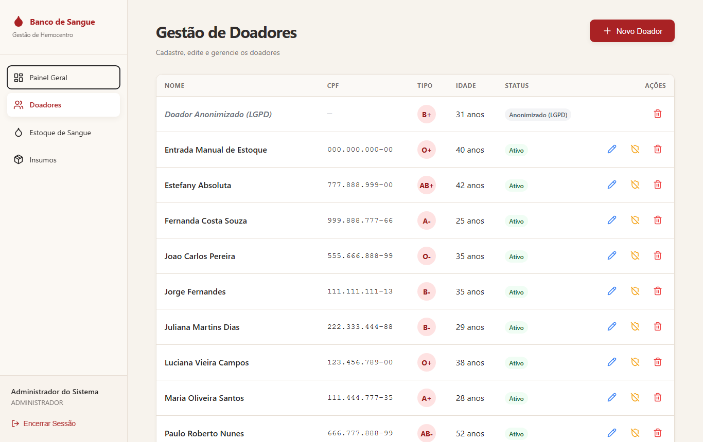
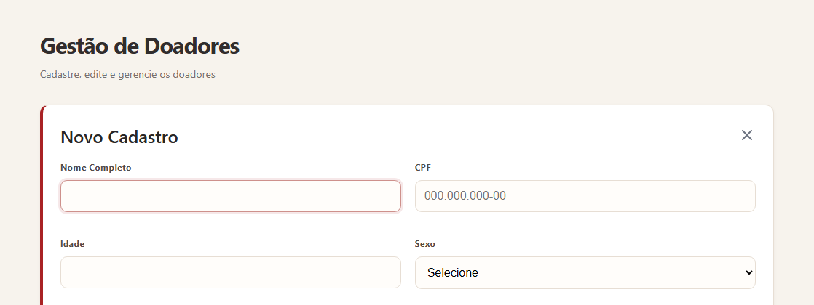

# Melhoria de Acessibilidade — TP4, Etapa 2

> **TP4:** [README](../../README.md) · [Relatório do TP4](../../RELATORIO-TP4.md) · [Avaliação heurística](../redesign/avaliacao-heuristica.md) · [Melhorias do redesign](../redesign/melhorias-implementadas.md) · [Planejamento da evolução](../evolucao/planejamento.md) · **Acessibilidade** · [Checklist e testes](../checklist-testes-tp4.md) · [CHANGELOG](../../CHANGELOG.md) · [Pull Request #78](https://github.com/AugustoAzev/banco-de-sangue/pull/78)

**Melhoria:** operação completa do sistema por **teclado** e por **leitor de tela**, com **contraste adequado** para baixa visão.
**Referência:** WCAG 2.1, nível AA.
**Pull Request:** [#78](https://github.com/AugustoAzev/banco-de-sangue/pull/78) · **Commit:** [`feat(a11y): operacao completa por teclado e leitor de tela (TP4 etapa 2)`](https://github.com/AugustoAzev/banco-de-sangue/commit/421bcbdb3715d8cd23a7bcfb004517eecc7ff9eb)

## 1. Problema identificado

O sistema é de uso interno: quem o opera são os profissionais do hemocentro. A medição do estado original, feita antes de qualquer mudança do TP4 (dados brutos em [`evidencias/relatorio-antes.json`](./evidencias/relatorio-antes.json)), mostrou que **uma pessoa que usa leitor de tela ou só o teclado não conseguia operar o sistema com segurança**:

| Achado | Onde | Medição |
|---|---|---|
| **Botões sem nome:** o leitor de tela anuncia apenas "botão" nas ações de editar, anonimizar e excluir | Doadores, Insumos | axe `button-name`: **25** elementos em Doadores, **18** em Insumos |
| **Campos sem rótulo associado:** o leitor anuncia "caixa de edição" sem dizer qual é | Formulário de doador, filtro e formulário do estoque | axe `label`: 5 campos; `select-name`: 3 listas |
| **Foco fica fora do diálogo de confirmação:** ao abrir "Excluir?" pelo teclado, o foco continua atrás do diálogo; ao fechar, o foco se perde no documento | Todas as confirmações | `focoAoAbrirDialogo.dentroDoDialogo = false` · `focoAoFecharDialogo = perdido` |
| **Sem atalho para o conteúdo:** todo o menu vem antes do conteúdo em todas as telas | Todas | 6 Tabs até "Novo Doador" |
| **Foco quase invisível nos campos:** o contorno era removido e trocado por uma sombra com 10% de opacidade | Todos os formulários | Ver capturas da seção 4 |
| **Contraste insuficiente:** texto secundário abaixo do mínimo de 4,5:1 | Todas as telas | Lighthouse "contrast" em todas as 5 telas |
| **Erros que somem em 6 s,** sem ligação com o campo | Cadastro de doador | Avaliação heurística, P08 |

Nota de acessibilidade do Lighthouse no estado original: **90 a 96**.

## 2. Por que isso afeta pessoas com deficiência

- **Leitor de tela (pessoa cega ou com baixa visão severa):**
  - um botão anunciado só como "botão" numa tabela com 14 doadores não permite saber qual ação será executada, nem em qual doador. "Excluir" sem contexto é um risco real de excluir o registro errado;
  - campos sem rótulo obrigam a adivinhar o que digitar.
- **Uso só do teclado (deficiência motora, lesão por esforço repetitivo, tremor):**
  - com o foco fora do diálogo, a pessoa continua navegando pela página escondida atrás dele e não consegue confirmar nem cancelar com segurança;
  - sem atalho, precisa percorrer o menu inteiro a cada tela;
  - com o foco invisível nos campos, não sabe onde está.
- **Baixa visão:** texto cinza claro sobre o fundo bege (4,34:1) e descrições em cinza mais claro ainda (2,54:1) ficam ilegíveis com redução de acuidade ou em monitores de baixa qualidade, comuns em postos de coleta.
- **Leitura mais lenta ou limitação cognitiva:** uma mensagem de erro que some em 6 segundos pode desaparecer antes de ser lida.

## 3. Solução implementada

| # | O que mudou | Critério WCAG | Arquivos |
|---|---|---|---|
| A1 | **Nome acessível com contexto em todos os botões de ícone**, por exemplo "Excluir doador Maria Oliveira Santos", "Editar insumo Luvas descartáveis" e "Registrar saída de bolsas O negativo". Os ícones decorativos ficam ocultos para o leitor de tela. | 4.1.2 Nome, função, valor · 2.4.6 Rótulos descritivos | `doadores`, `insumos`, `estoque` |
| A2 | **Rótulos ligados aos campos** (`label htmlFor` + `id`) em todos os formulários e filtros; campos obrigatórios marcados com `required` e "*". | 1.3.1 Informação e relações · 3.3.2 Rótulos ou instruções | todas as telas com formulário |
| A3 | **Erros ligados ao campo:** `aria-invalid` e `aria-describedby` apontam para a mensagem, e o foco vai para o primeiro campo com erro. O leitor anuncia o rótulo, que o campo está inválido e a mensagem ("O CPF deve ter 11 dígitos (foram informados 3)"). | 3.3.1 Identificação do erro · 3.3.3 Sugestão de correção | `doadores`, `estoque`, `insumos` |
| A4 | **Diálogo de confirmação acessível:** o foco entra no "Cancelar", a opção segura; o Tab fica preso dentro do diálogo; Esc cancela; ao fechar, o foco volta ao botão que abriu. | 2.4.3 Ordem do foco · 2.1.2 Sem armadilha de teclado | [`src/contexts/ToastContext.tsx`](../../src/contexts/ToastContext.tsx) |
| A5 | **Foco gerenciado nos formulários:** ao abrir, o foco vai para o primeiro campo; ao fechar ou salvar, volta ao botão de origem. | 2.4.3 Ordem do foco | [`src/hooks/use-focus-target.ts`](../../src/hooks/use-focus-target.ts) |
| A6 | **"Pular para o conteúdo principal"**, primeiro item no Tab; `main` identificado; menu com `aria-label`; título de página próprio por tela ("Doadores — Banco de Sangue"). | 2.4.1 Ignorar blocos · 2.4.2 Página com título | [`app/(protected)/layout.tsx`](../../app/(protected)/layout.tsx); títulos nos metadados de [`app/layout.tsx`](../../app/layout.tsx) e do `layout.tsx` de cada tela |
| A7 | **Indicador de foco visível e igual em todo o sistema:** contorno azul de 3 px, com contraste de 6:1 sobre o fundo. | 2.4.7 Foco visível | [`app/globals.css`](../../app/globals.css) |
| A8 | **Contraste corrigido** (ver tabela abaixo). | 1.4.3 Contraste mínimo | [`app/globals.css`](../../app/globals.css) |
| A9 | **Tabelas com legenda e cabeçalhos** (`caption`, `scope="col"`); tipo sanguíneo lido por extenso ("O negativo" em vez de "O traço"). | 1.3.1 Informação e relações | tabelas e painel |
| A10 | **Avisos de erro não somem sozinhos**; os de sucesso ficam 8 s. Animações respeitam a configuração "reduzir movimento" do sistema operacional. | 2.2.1 Tempo ajustável · 2.3.3 Animação por interação (AAA, extra) | [`ToastContext.tsx`](../../src/contexts/ToastContext.tsx), [`globals.css`](../../app/globals.css) |
| A11 | **Mudanças dinâmicas anunciadas:** a contagem da busca de doadores e o preenchimento do endereço pelo CEP ficam em regiões `aria-live`. | 4.1.3 Mensagens de status | `doadores` |

### Contraste (texto)

| Elemento | Antes | Depois |
|---|---|---|
| Texto secundário (`--color-text-muted`) sobre o fundo bege | `#77716f` — 4,34:1 ✗ | `#6b6563` — 5,18:1 ✓ |
| Descrição dos cards do painel | `#9ca3af` — 2,54:1 ✗ | `#6b6563` — 5,73:1 ✓ |
| Texto de apresentação do login | `#748079` — 4,11:1 ✗ | `#5f6b64` — 5,56:1 ✓ |
| Rodapé do login | `#9aa7a0` — 2,50:1 ✗ | `#5f6b64` — 5,56:1 ✓ |

O novo tom de texto secundário passa de 4,87:1 em **todos** os fundos usados no sistema (bege, branco, menu lateral, cabeçalho de tabela, seção LGPD). A identidade visual foi mantida: o tom continua quente, só mais escuro.

## 4. Evidências

### Medição automatizada (Lighthouse — categoria Acessibilidade)

As três medições usam o mesmo roteiro ([`scripts/capturar-evidencias.mjs`](../../scripts/capturar-evidencias.mjs)) e o mesmo banco. A coluna do meio separa o que veio do redesign (Etapa 1) do que veio desta melhoria.

| Tela | Original | Após redesign (Etapa 1) | Após acessibilidade (Etapa 2) |
|---|---|---|---|
| Login | 96 | 96 | **100** |
| Painel | 96 | 96 | **100** |
| Doadores | 90 | 96 | **100** |
| Estoque | 92 | 92 | **100** |
| Insumos | 90 | 96 | **100** |

### Violações WCAG 2.1 A/AA detectadas pelo axe-core (elementos afetados)

| Estado da tela | Original | Após redesign | Após acessibilidade |
|---|---|---|---|
| Login | 2 | 2 | **0** |
| Painel | 7 | 7 | **0** |
| Doadores | 27 | 2 | **0** |
| Doadores — formulário aberto | 35 | 9 | **0** |
| Estoque | 3 | 3 | **0** |
| Insumos | 20 | 2 | **0** |
| Diálogo de confirmação aberto | 27 | 2 | **0** |

### Teste de teclado (roteiro automatizado, só com Tab, Enter e Esc)

| Verificação | Original | Depois |
|---|---|---|
| Primeiro elemento ao apertar Tab | "Painel Geral" (menu) | **"Pular para o conteúdo principal"** |
| Teclas até o botão "Novo Doador" | 6 | **3** (Tab, Enter, Tab) |
| O que o leitor anuncia na primeira ação da tabela | "(sem nome)" | **"Excluir doador Doador Anonimizado (LGPD)"** |
| Foco ao abrir o diálogo de confirmação | fora do diálogo | **no "Cancelar", dentro do diálogo** |
| Foco depois de 3 Tabs com o diálogo aberto | fora do diálogo | **continua dentro do diálogo** |
| Foco ao fechar o diálogo | perdido no documento | **volta ao botão que o abriu** |

Testes de ponta a ponta pela interface (44 verificações, inclusive cadastro feito só pelo teclado): [checklist e testes](../checklist-testes-tp4.md).

Dados brutos: [`relatorio-antes.json`](./evidencias/relatorio-antes.json), [`relatorio-pos-redesign.json`](./evidencias/relatorio-pos-redesign.json), [`relatorio-depois.json`](./evidencias/relatorio-depois.json). Os campos `ariaMain` e `ariaForm` registram a árvore de acessibilidade, que é o que o leitor de tela recebe, de cada tela.

### Capturas

| Primeiro Tab — antes | Primeiro Tab — depois |
|---|---|
|  |  |

| Foco em campo — antes (sombra a 10%) | Foco em campo — depois (contorno de 3 px) |
|---|---|
|  |  |

| Diálogo — antes (foco no botão atrás do diálogo) | Diálogo — depois (foco dentro do diálogo) |
|---|---|
|  |  |

Todas as telas do estado final, inclusive no celular, com a descrição de cada uma, estão na galeria [`screenshots/estado-final/`](./screenshots/estado-final/). As medições brutas estão em [`evidencias/`](./evidencias/).

## 5. Como verificar manualmente

1. **Teclado:**
   - Abra **Doadores** e aperte **Tab**: deve aparecer "Pular para o conteúdo principal". Aperte **Enter** e depois **Tab**: o foco vai para "Novo Doador".
   - Abra o cadastro, deixe o CPF com 3 dígitos e envie: o foco vai para o CPF, com a mensagem abaixo.
   - Na tabela, chegue a uma lixeira com Tab e aperte **Enter**: o foco vai para "Cancelar"; Tab circula só entre "Cancelar" e "Confirmar"; **Esc** fecha e devolve o foco à lixeira.
2. **Leitor de tela:** com o NVDA (gratuito, Windows) ligado, passe pelos botões da tabela de doadores. Cada um deve ser anunciado com a ação e o nome do doador. Na busca, ao digitar "maria", o NVDA deve anunciar a contagem ("1 de 13 doadores encontrados") sem tirar o foco do campo.
3. **Contraste:** no Chrome, abra DevTools → Lighthouse → Acessibilidade, ou use a extensão axe DevTools.

## 6. Limitações

- **Validação automatizada, não com usuários:** as medições são automatizadas (Lighthouse, axe) e o roteiro de teclado também. Uma validação com um usuário real de leitor de tela não foi feita dentro do prazo do TP e é o próximo passo recomendado.
- **Nota 100 não garante acessibilidade total:** as ferramentas automáticas detectam só parte dos problemas possíveis (as estimativas publicadas variam de 30% a 57%). A seção 5 cobre o que precisa de verificação humana.
