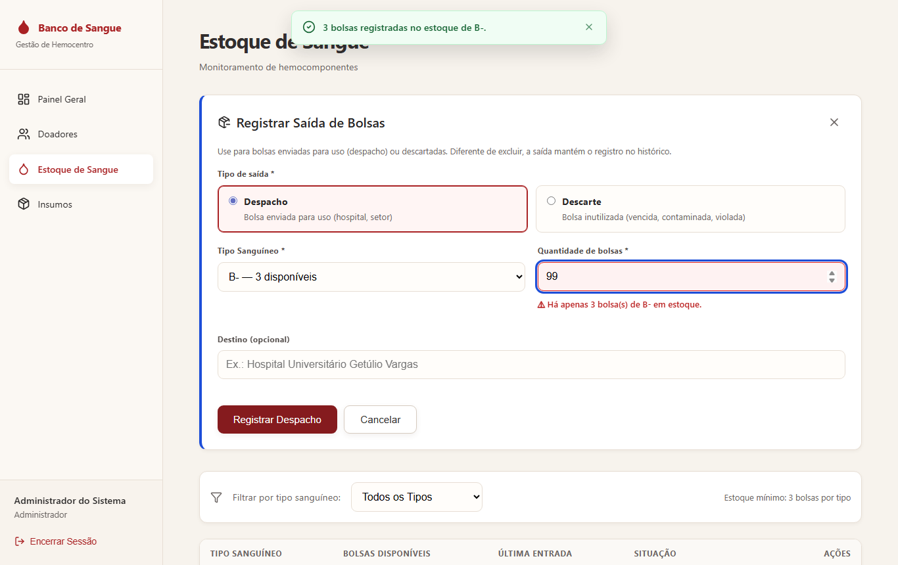
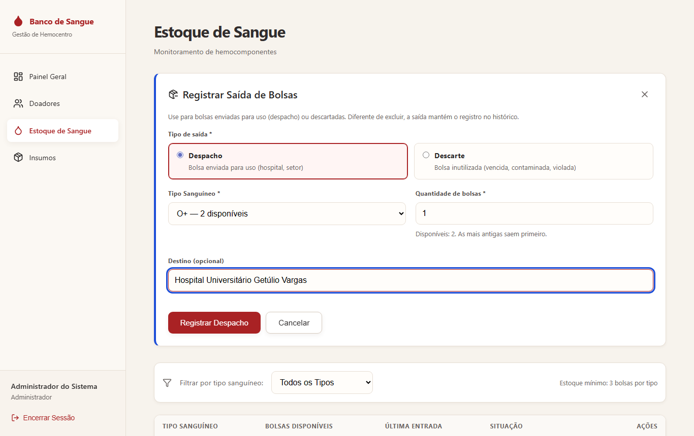
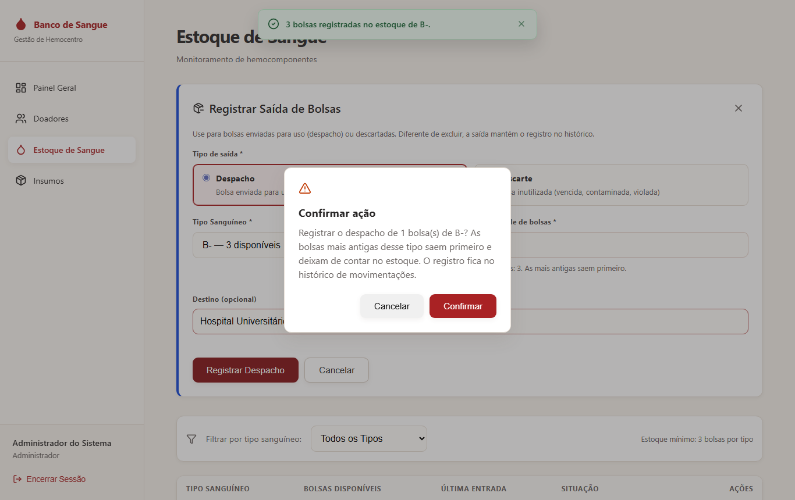
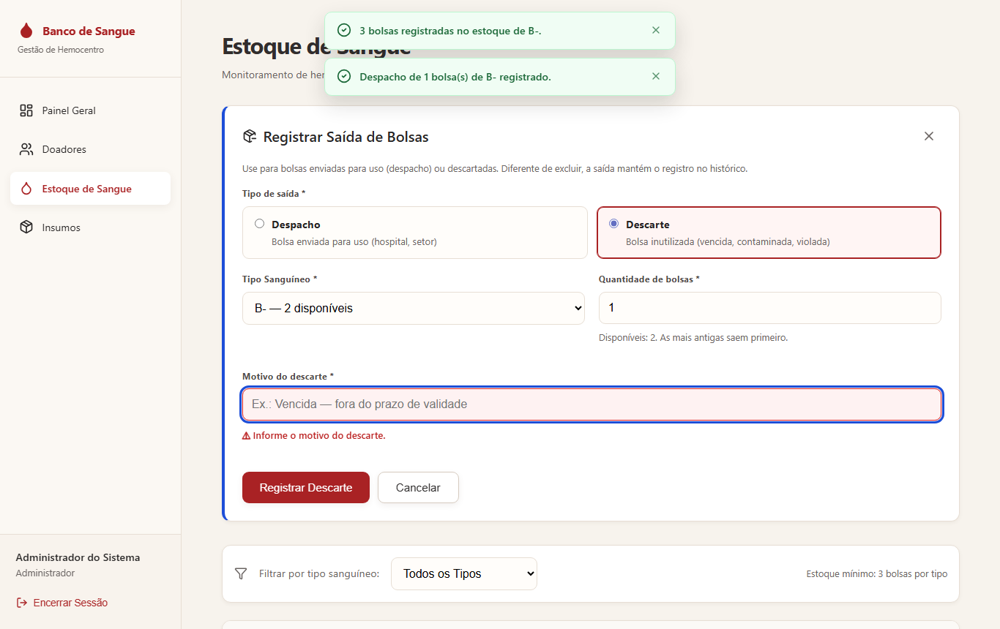
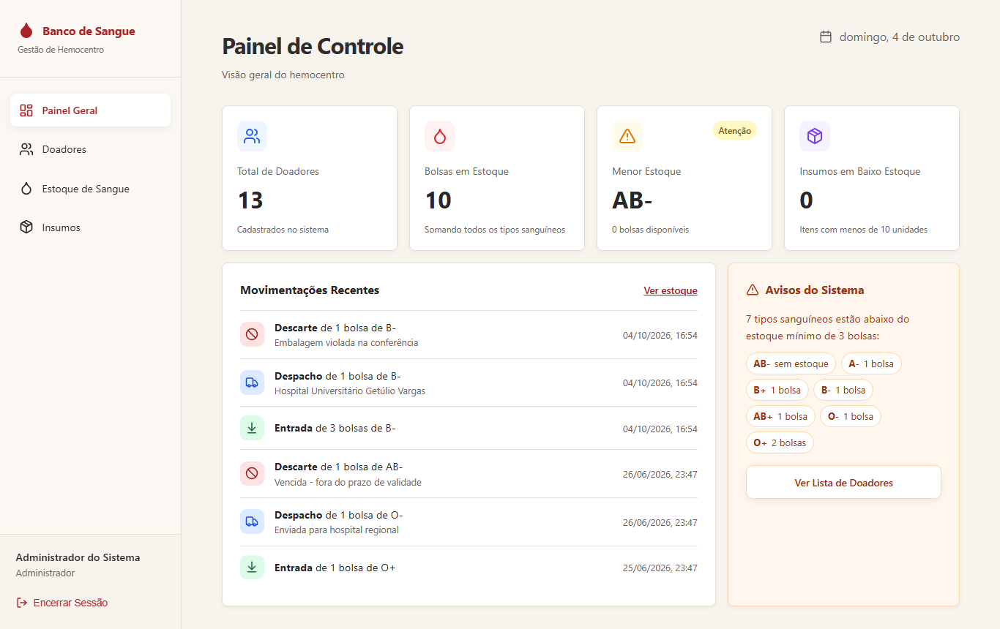
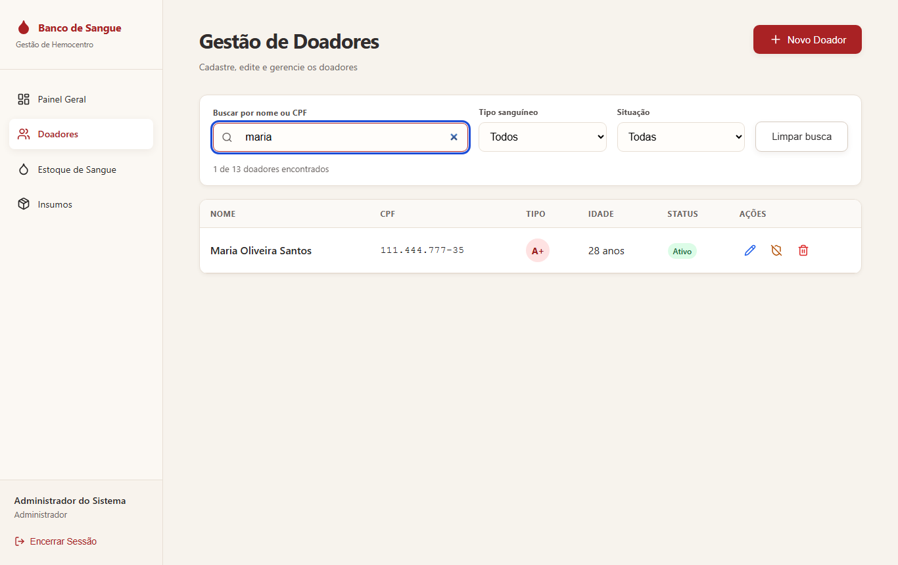
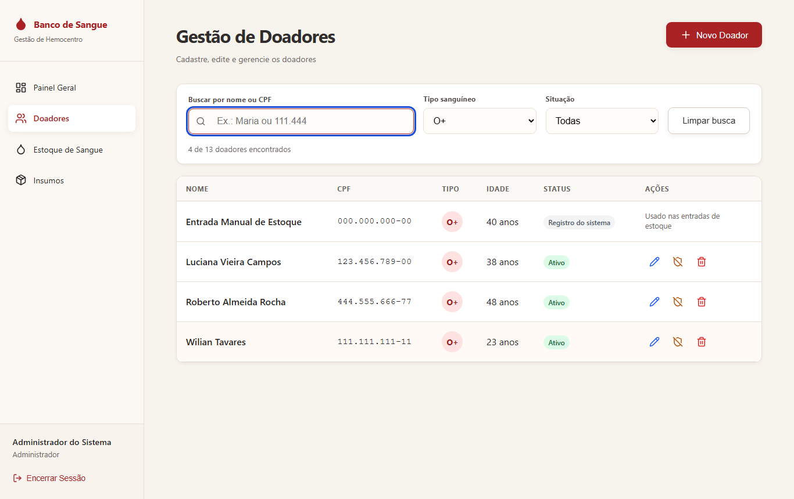
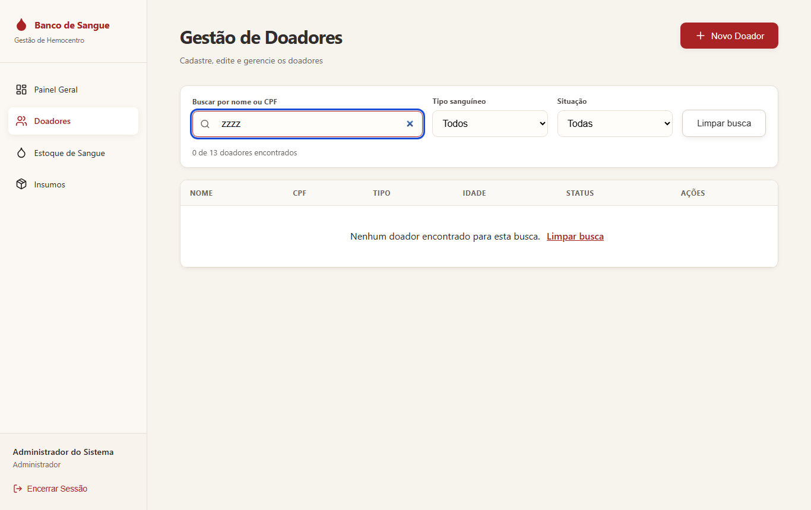

# Planejamento da Evolução — TP4, Etapa 2 (Manutenção Evolutiva)

> **TP4:** [README](../../README.md) · [Relatório do TP4](../../RELATORIO-TP4.md) · [Avaliação heurística](../redesign/avaliacao-heuristica.md) · [Melhorias do redesign](../redesign/melhorias-implementadas.md) · **Planejamento da evolução** · [Acessibilidade](../evolucao/acessibilidade.md) · [Checklist e testes](../checklist-testes-tp4.md) · [CHANGELOG](../../CHANGELOG.md) · [Pull Request #78](https://github.com/AugustoAzev/banco-de-sangue/pull/78)

**Disciplina:** Manutenção e Integração de Software — TP4
**Data:** 04/10/2026
**Pull Request:** [#78](https://github.com/AugustoAzev/banco-de-sangue/pull/78) · **Commit:** [`feat(evolucao): saida de bolsas com historico e busca de doadores (TP4 etapa 2)`](https://github.com/AugustoAzev/banco-de-sangue/commit/8127f27b6a07844533f978b33884f6eb0ed6631a)

## 1. Objetivo da etapa

O sistema é usado pela equipe do hemocentro (perfis Administrador e Atendente) para gerenciar registros de doadores, estoque de sangue e insumos. A evolução amplia esse mesmo propósito, sem criar áreas novas nem mudar o público do sistema.

O objetivo que atravessa todo o TP4 é que **qualquer profissional do hemocentro consiga fazer o trabalho de registro**, inclusive quem tem baixa visão, usa só o teclado ou usa leitor de tela. Por isso:

- as duas funcionalidades novas foram construídas já acessíveis;
- a melhoria de acessibilidade obrigatória está em [`acessibilidade.md`](./acessibilidade.md), neste mesmo diretório.

As duas funcionalidades nasceram de problemas apontados na [avaliação heurística](../redesign/avaliacao-heuristica.md) que não podiam ser resolvidos só com redesign:

| Funcionalidade | Problemas da avaliação que resolve |
|---|---|
| 1. Registro de saída de bolsas com histórico | P16 (só era possível excluir), P03 ("Movimentações Recentes" fixo) |
| 2. Busca de doadores | P15 (lista sem busca nem filtro) |

---

## 2. Funcionalidade 1 — Registro de saída de bolsas (despacho e descarte)

### Problema

No hemocentro, uma bolsa sai do estoque de dois jeitos: é **despachada** para uso (hospital, setor) ou **descartada** (vencimento, contaminação, embalagem violada). O banco já previa esses status (`DESPACHADA` e `DESCARTADA` no enum `statusdoacao`), mas nenhuma tela os usava.

A única forma de tirar bolsas do estoque era **excluir o lote**, o que apaga os registros. Isso tem três consequências:

- **Rastreabilidade:** perde-se o histórico de para onde cada bolsa foi, que a ANVISA exige e que o TP3 usou como argumento para anonimizar em vez de excluir.
- **Indicadores:** o estoque "diminui" sem deixar rastro de por quê.
- **Painel:** o card "Movimentações Recentes" mostrava um texto fixo, porque não havia movimentações para mostrar.

### O que foi implementado

- **Registrar Saída**, na tela de estoque. Há dois caminhos:
  - o botão no cabeçalho;
  - o botão em cada linha da tabela, que já vem com o tipo sanguíneo escolhido.
- **O formulário pede:**
  - o tipo de saída (Despacho ou Descarte);
  - o tipo sanguíneo, listando só os tipos com estoque e a quantidade disponível ("B- — 3 disponíveis");
  - a quantidade;
  - o destino (opcional no despacho) ou o motivo (**obrigatório** no descarte).
- **Confirmação** antes de gravar, explicando que as bolsas mais antigas saem primeiro e que o registro fica no histórico.
- **Movimentações Recentes** passa a mostrar dados reais (entradas, despachos e descartes, com quantidade, tipo, observação e data) no painel e no fim da tela de estoque.

### Regras de negócio

| Regra | Motivo |
|---|---|
| As bolsas **mais antigas** do tipo saem primeiro (FIFO, por `data_doacao`) | Reduz o risco de vencimento no estoque |
| A saída **muda o status**, não apaga a bolsa | Preserva a rastreabilidade (diferença central em relação a "Excluir lote") |
| O descarte **exige motivo**; o despacho aceita destino opcional | O motivo do descarte é a informação que justifica a perda |
| Não é possível dar saída em mais bolsas do que há do tipo | Validado na tela e na API (`400 Há apenas N bolsa(s) de X em estoque`) |
| O `PATCH` filtra `status=EM_ESTOQUE` | Se duas pessoas registrarem saídas ao mesmo tempo, uma bolsa não sai duas vezes |

### Decisões técnicas

- **Sem migration.** Foram usados os status que o banco já tinha e a coluna `observacoes` para o destino ou motivo. Ninguém do grupo precisa rodar SQL no Supabase para a funcionalidade funcionar. Nas bolsas lançadas pelo sistema, `observacoes` vem vazio na entrada; ele só é preenchido quando a saída tem texto.
- **Histórico reconstruído das próprias bolsas.** [`GET /api/inventory/movimentacoes`](../../pages/api/inventory/movimentacoes.ts) deriva as movimentações dos registros. Toda bolsa gera uma entrada na `data_doacao`, e as que saíram geram uma saída em `atualizado_em`. Uma entrada de N bolsas é gravada num único `INSERT` e uma saída num único `UPDATE`. Agrupar por tipo, data e status recupera cada operação com a sua quantidade ([`src/lib/stock-movements.ts`](../../src/lib/stock-movements.ts)).
- **Regra separada da rota.** A validação (`parseStockExit`) e a reconstrução do histórico (`buildMovements`) são funções puras, testadas sem banco.

### Contrato da API

[`POST /api/inventory/saidas`](../../pages/api/inventory/saidas.ts) (autenticado)

```json
{ "tipo_sangue": "B_NEGATIVO", "quantidade": 1, "status": "DESPACHADA", "observacoes": "Hospital Universitário Getúlio Vargas" }
```

- **Respostas:**
  - `200`: `{ tipo_sangue, status, quantidade, observacoes }`;
  - `400`: validação ou estoque insuficiente;
  - `401`: sem token;
  - `405`: outro método;
  - `502`: erro no banco.
- [`GET /api/inventory/movimentacoes?limite=8`](../../pages/api/inventory/movimentacoes.ts) devolve as últimas movimentações, ordenadas da mais recente para a mais antiga. O limite máximo é 50.

### Acessibilidade já incluída

- **Grupo de opções:** o tipo de saída é um grupo de botões de opção com `fieldset`/`legend`.
- **Rótulos e erros ligados aos campos:** todos os campos têm rótulo (`htmlFor`), e erros e dicas estão ligados ao campo (`aria-describedby`, `aria-invalid`).
- **Foco:**
  - ao abrir pela linha da tabela, o foco vai direto para a quantidade;
  - num erro, o foco vai para o campo com problema;
  - ao fechar, o foco volta ao botão de origem.
- **Botão da linha com nome completo:** "Registrar saída de bolsas B negativo".
- **Tipo lido por extenso:** no histórico, o leitor de tela lê o tipo sanguíneo por extenso, e a data está num elemento `time`.

### Evidências

| Erro: mais bolsas do que o estoque | Despacho preenchido | Confirmação |
|---|---|---|
|  |  |  |

| Descarte sem motivo (bloqueado) | Painel com as movimentações reais |
|---|---|
|  |  |

Tela de estoque depois das saídas: [`05-estoque-apos-saidas.png`](screenshots/funcionalidades/05-estoque-apos-saidas.png).

A demonstração foi feita **pela interface, no banco real do grupo**:

1. Entrada de 3 bolsas B−, tipo que estava sem estoque.
2. Despacho de 1 bolsa para "Hospital Universitário Getúlio Vargas".
3. Descarte de 1 bolsa com o motivo "Embalagem violada na conferência".

O B− terminou com 1 bolsa em estoque. Os três registros aparecem no histórico do painel.

---

## 3. Funcionalidade 2 — Busca de doadores

### Problema

A lista de doadores não tinha busca nem filtro (P15, heurística H7). Para conferir se um doador já está cadastrado, ou achar os doadores de um tipo sanguíneo, era preciso rolar a lista inteira, que cresce a cada cadastro.

### O que foi implementado

Uma barra de busca acima da lista, com três critérios que podem ser combinados:

- **Nome ou CPF (texto):**
  - o nome é comparado sem diferenciar maiúsculas nem acentos ("joao" encontra "João");
  - o CPF é comparado pelos dígitos, com ou sem máscara nos dois lados ("111.444" encontra `11144477735`);
  - o CPF só é considerado a partir de 3 dígitos, para evitar resultados aleatórios.
- **Tipo sanguíneo.**
- **Situação:** todas, ativos ou anonimizados (LGPD).

Junto da busca:

- a contagem "1 de 13 doadores encontrados";
- o botão "Limpar busca";
- quando nada é encontrado, a mensagem "Nenhum doador encontrado para esta busca", com o atalho para limpar.

### Decisões técnicas

- **Busca feita na tela.** O [`GET /donors`](../../pages/api/donors/index.ts) já devolve a lista inteira, então filtrar no navegador evita uma nova consulta ao banco a cada tecla. A regra está em [`src/lib/donor-search.ts`](../../src/lib/donor-search.ts), função pura testada à parte.
- **Doadores anonimizados não quebram a busca.** O CPF nulo é tratado, e esses doadores continuam encontráveis pelo filtro de situação.

### Acessibilidade já incluída

- **Região de busca identificada:** a barra tem `role="search"`, e cada campo tem rótulo visível.
- **Contagem anunciada:** a contagem fica numa região `aria-live="polite"`, então o leitor de tela anuncia quantos doadores foram encontrados a cada mudança, sem tirar o foco do campo.
- **Foco ao limpar:** "Limpar busca" devolve o foco ao campo de texto.

### Evidências

| Por nome ("maria") | Por CPF parcial ("111.444") |
|---|---|
|  |  |

| Por tipo sanguíneo (O+) | Sem resultado |
|---|---|
|  |  |

---

## 4. Testes

| Arquivo | O que cobre |
|---|---|
| [`tests/evolucao-saidas-movimentacoes.test.ts`](../../tests/evolucao-saidas-movimentacoes.test.ts) | Validação da saída (motivo obrigatório no descarte, tipos e quantidades inválidos); `POST /saidas` usa `PATCH` (não `DELETE`), escolhe as mais antigas, filtra `EM_ESTOQUE`, recusa estoque insuficiente sem gravar; agrupamento do histórico; limites do `GET /movimentacoes` |
| [`tests/evolucao-busca-doadores.test.ts`](../../tests/evolucao-busca-doadores.test.ts) | Nome sem acento, CPF com e sem máscara, mínimo de 3 dígitos, CPF nulo, filtros por tipo e situação combinados |

Total do projeto: **80 testes** (33 antes do TP4), todos passando. `next build` e `tsc --noEmit` sem erros.

As duas funcionalidades também foram testadas pela interface, no banco real, com o roteiro [`scripts/testar-tp4-e2e.mjs`](../../scripts/testar-tp4-e2e.mjs) (verificações D1–D6 e E1–E4). Resultado em [checklist e testes](../checklist-testes-tp4.md).

## 5. Limitações conhecidas e próximos passos

- **A saída não registra quem a fez.** A tabela `doacoes` só tem `id_registrador`, da entrada. Guardar o responsável pela saída exigiria uma coluna nova, ou seja, uma migration. Fica como próximo passo.
- **Janela do histórico:** o histórico é reconstruído a partir das 500 bolsas atualizadas mais recentemente. Para um volume muito maior, valeria uma tabela própria de movimentações.
- **Busca no navegador:** a busca é feita na tela. Se a base de doadores crescer para milhares de registros, o filtro deve passar para a API com paginação.
