# Capturas — ESTADO FINAL do sistema (fim do TP4)

> Parte do TP4 · [Relatório do TP4](../../../../RELATORIO-TP4.md) · [Acessibilidade](../../acessibilidade.md) · Estados anteriores: [antes](../../../redesign/screenshots/antes/) → [depois do redesign](../../../redesign/screenshots/depois-do-redesign/)

Como **o sistema inteiro ficou depois do TP4**, com o redesign (Etapa 1), as funcionalidades novas e a melhoria de acessibilidade (Etapa 2). As capturas foram feitas com o build de produção do commit final da branch do TP4, o mesmo roteiro e o mesmo banco dos estados anteriores. Os nomes 01–12 correspondem aos das pastas [antes](../../../redesign/screenshots/antes/) e [depois do redesign](../../../redesign/screenshots/depois-do-redesign/); as capturas 13–15 mostram as telas no celular.

Neste estado: **Lighthouse 100** nas 5 telas e **nenhuma violação** WCAG A/AA no axe. Medições em [`relatorio-depois.json`](../../evidencias/relatorio-depois.json).

| Arquivo | O que mostra | Compare com | Documentação |
|---|---|---|---|
| [`01-login.png`](./01-login.png) | Login com contraste corrigido | [antes](../../../redesign/screenshots/antes/01-login.png) | [A8 — contraste](../../acessibilidade.md#3-solução-implementada) |
| [`02-dashboard.png`](./02-dashboard.png) | Painel com números corretos, avisos por estoque mínimo e **movimentações reais** | [antes](../../../redesign/screenshots/antes/02-dashboard.png) · [depois do redesign](../../../redesign/screenshots/depois-do-redesign/02-dashboard.png) | [M01](../../../redesign/melhorias-implementadas.md#m01--painel-com-números-corretos-h1-h4), [Funcionalidade 1](../../planejamento.md#2-funcionalidade-1--registro-de-saída-de-bolsas-despacho-e-descarte) |
| [`03-doadores.png`](./03-doadores.png) | Lista com **busca** (nome/CPF, tipo, situação) e registro do sistema protegido | [antes](../../../redesign/screenshots/antes/03-doadores.png) | [Funcionalidade 2](../../planejamento.md#3-funcionalidade-2--busca-de-doadores), [M03](../../../redesign/melhorias-implementadas.md#m03--registro-interno-do-sistema-protegido-h5) |
| [`04-estoque.png`](./04-estoque.png) | Estoque com **Registrar Saída**, ação de saída por linha e histórico de movimentações | [antes](../../../redesign/screenshots/antes/04-estoque.png) · [depois do redesign](../../../redesign/screenshots/depois-do-redesign/04-estoque.png) | [Funcionalidade 1](../../planejamento.md#2-funcionalidade-1--registro-de-saída-de-bolsas-despacho-e-descarte) |
| [`05-insumos.png`](./05-insumos.png) | Insumos com nomes acessíveis nos botões | [antes](../../../redesign/screenshots/antes/05-insumos.png) | [A1](../../acessibilidade.md#3-solução-implementada) |
| [`06-doadores-formulario.png`](./06-doadores-formulario.png) | Formulário de doador com rótulos ligados aos campos | [antes](../../../redesign/screenshots/antes/06-doadores-formulario.png) | [A2](../../acessibilidade.md#3-solução-implementada) |
| [`07-doadores-erro-cpf.png`](./07-doadores-erro-cpf.png) | Erro de CPF junto do campo, que recebe o foco | [antes](../../../redesign/screenshots/antes/07-doadores-erro-cpf.png) | [M04](../../../redesign/melhorias-implementadas.md#m04--erros-junto-ao-campo-h9), [A3](../../acessibilidade.md#3-solução-implementada) |
| [`08-doadores-erro-apos-6s.png`](./08-doadores-erro-apos-6s.png) | O erro continua visível 6 s depois | [antes](../../../redesign/screenshots/antes/08-doadores-erro-apos-6s.png) | [M04](../../../redesign/melhorias-implementadas.md#m04--erros-junto-ao-campo-h9) |
| [`09-teclado-foco-acao.png`](./09-teclado-foco-acao.png) | Foco por teclado numa ação da tabela, anunciada como "Excluir doador …" | [antes](../../../redesign/screenshots/antes/09-teclado-foco-acao.png) | [A1](../../acessibilidade.md#3-solução-implementada) |
| [`10-dialogo-confirmacao.png`](./10-dialogo-confirmacao.png) | Diálogo com o foco **dentro**, no "Cancelar" | [antes](../../../redesign/screenshots/antes/10-dialogo-confirmacao.png) | [A4](../../acessibilidade.md#3-solução-implementada) |
| [`11-primeiro-tab.png`](./11-primeiro-tab.png) | Primeiro Tab: atalho "Pular para o conteúdo principal" | [antes](../../../redesign/screenshots/antes/11-primeiro-tab.png) | [A6](../../acessibilidade.md#3-solução-implementada) |
| [`12-foco-campo.png`](./12-foco-campo.png) | Campo com foco: contorno azul de 3 px | [antes](../../../redesign/screenshots/antes/12-foco-campo.png) | [A7](../../acessibilidade.md#3-solução-implementada) |
| [`13-celular-painel.png`](./13-celular-painel.png) | Painel no celular (390 px) | — | [checklist G10](../../../checklist-testes-tp4.md#regressão--áreas-vizinhas-que-poderiam-quebrar-1616) |
| [`14-celular-doadores.png`](./14-celular-doadores.png) | Doadores no celular: a página cabe na tela e só a tabela rola de lado | — | [checklist G10](../../../checklist-testes-tp4.md#regressão--áreas-vizinhas-que-poderiam-quebrar-1616) |
| [`15-celular-estoque.png`](./15-celular-estoque.png) | Estoque no celular | — | [checklist G10](../../../checklist-testes-tp4.md#regressão--áreas-vizinhas-que-poderiam-quebrar-1616) |

## Galeria

### 02 — Painel
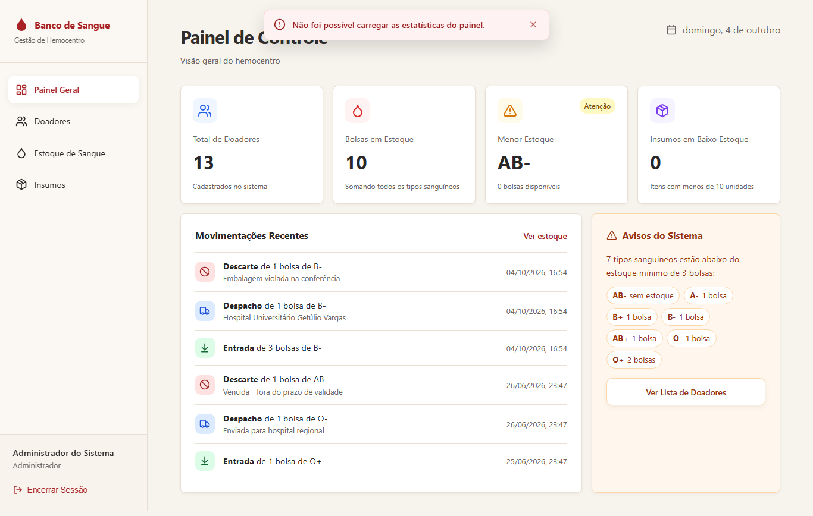

### 04 — Estoque

### 03 — Doadores
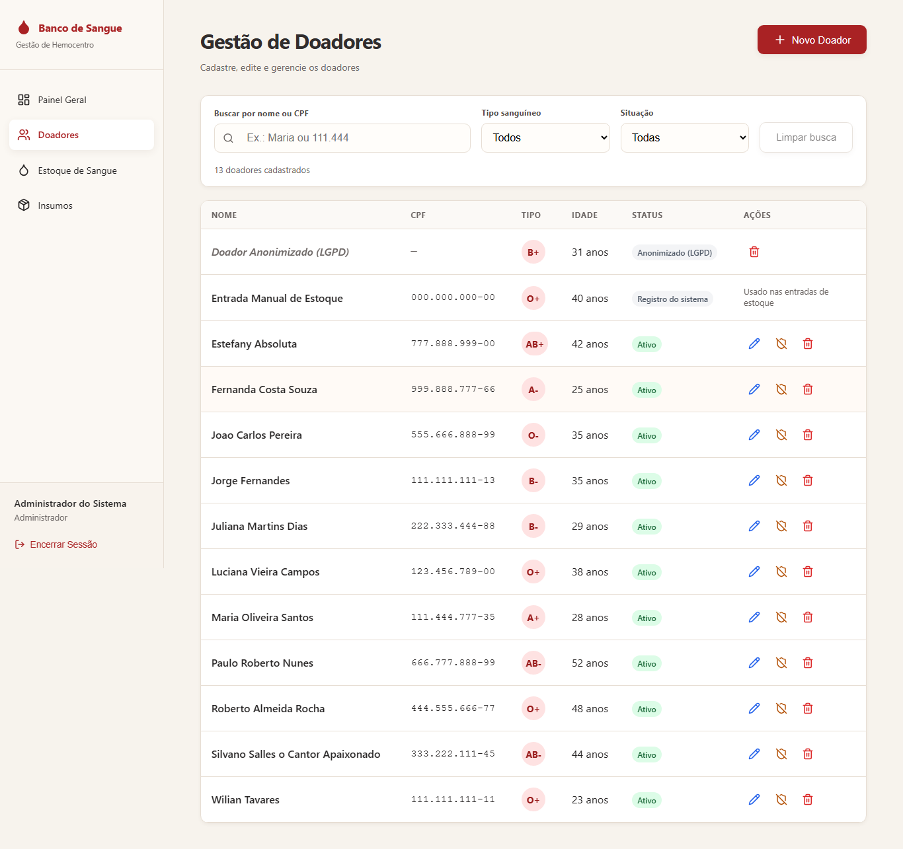

### Acessibilidade — atalho, foco e diálogo
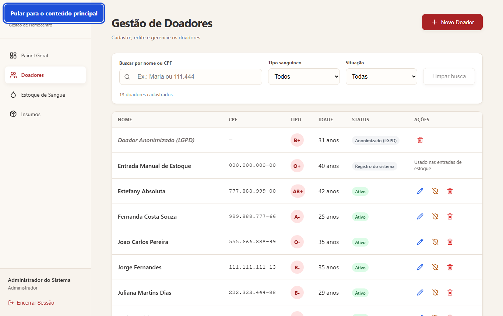
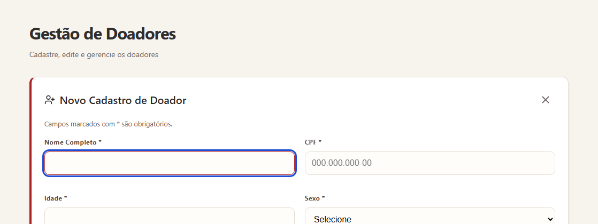
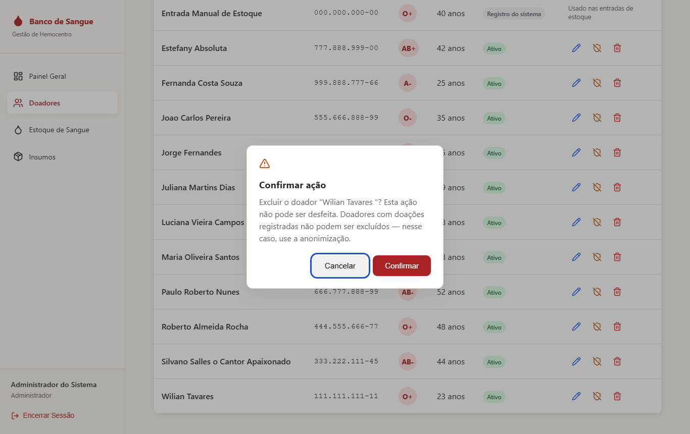
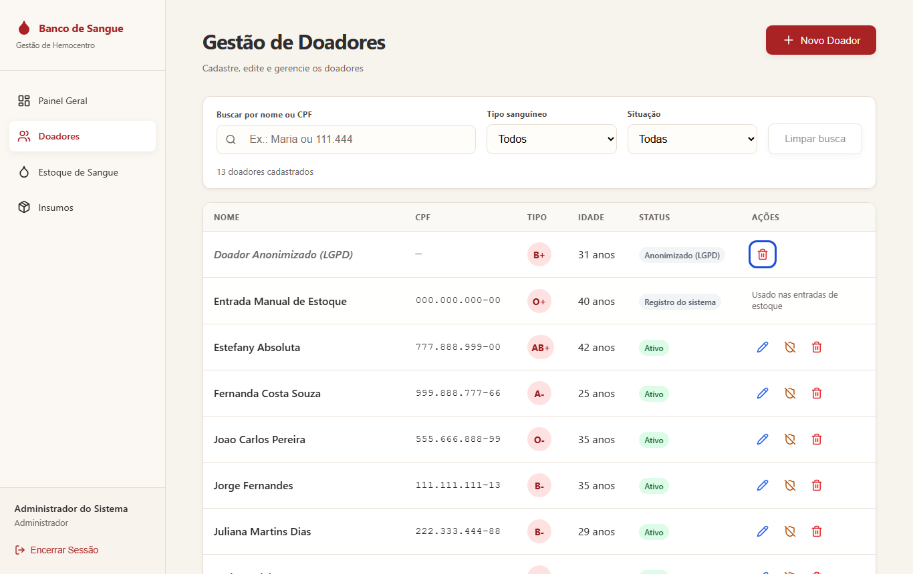

### Formulário e erros
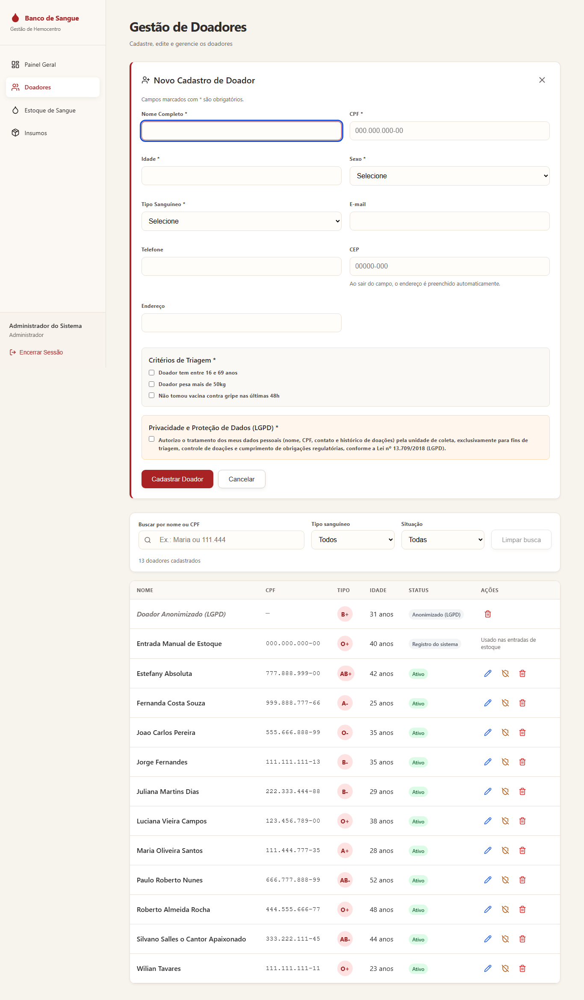

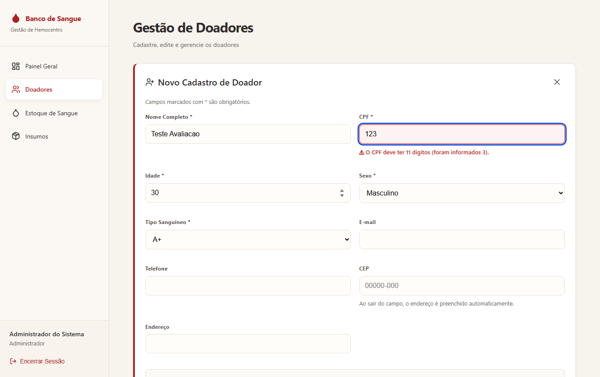

### Login e insumos
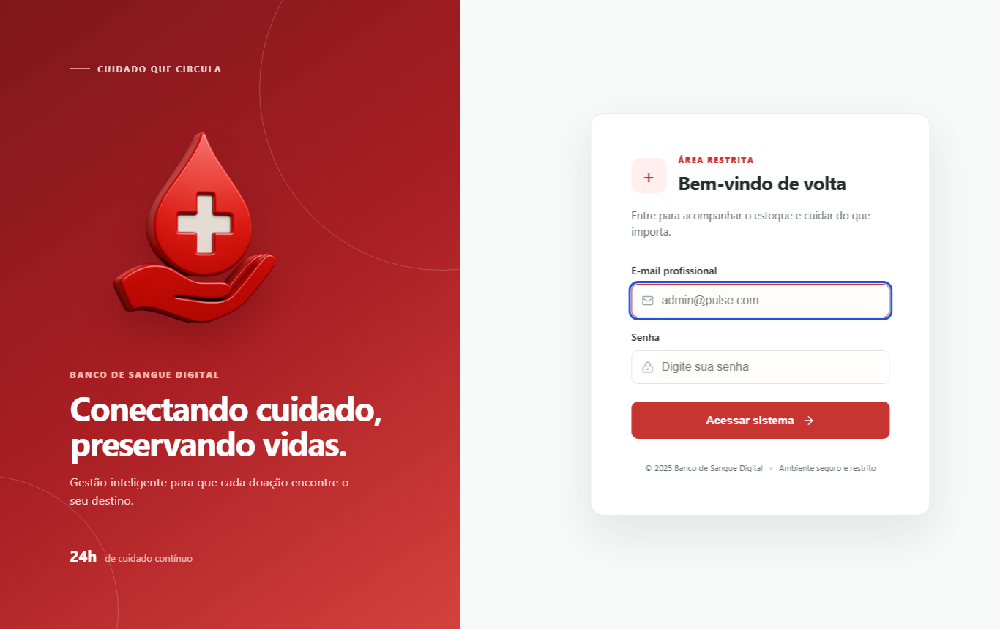
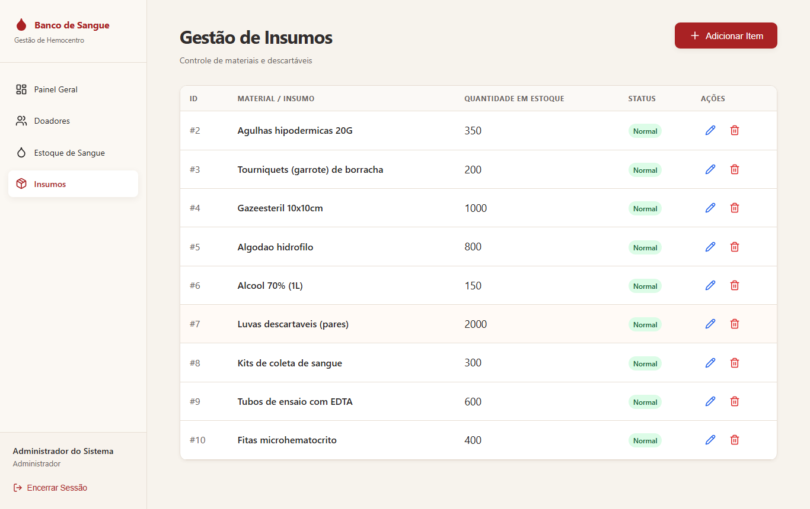

### Celular (390 px)
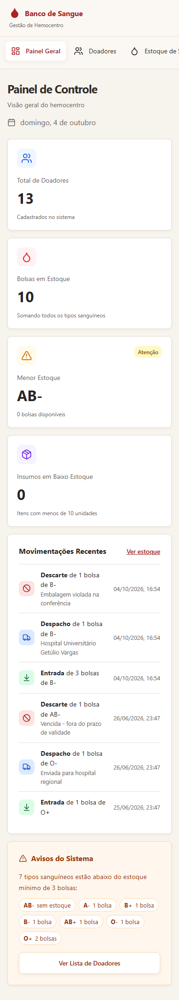
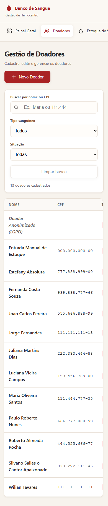
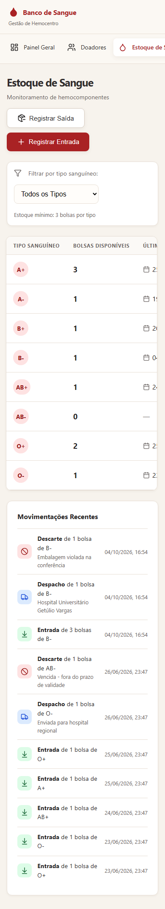
