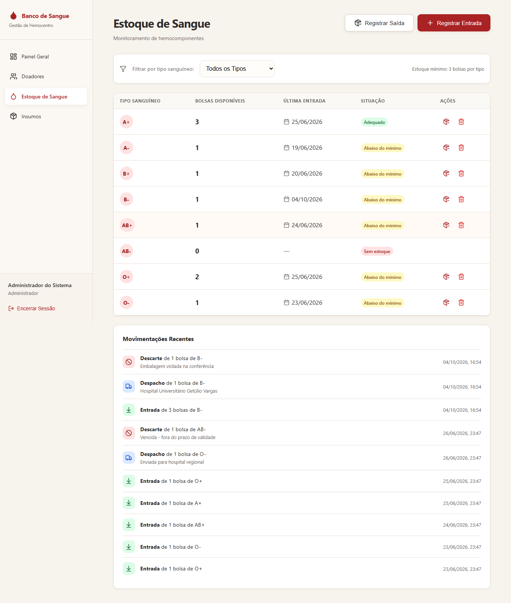

# Capturas — FUNCIONALIDADES NOVAS (Etapa 2)

> Parte do TP4 · [Relatório do TP4](../../../../RELATORIO-TP4.md) · [Planejamento da evolução](../../planejamento.md) · Ver também: [estado final do sistema](../estado-final/)

Demonstração das duas funcionalidades novas, feita **pela interface, no banco real do grupo**, com o sistema completo (Etapa 1 + Etapa 2).

1. Entrada de 3 bolsas B−, tipo que estava sem estoque.
2. Despacho de 1 bolsa para um hospital.
3. Descarte de 1 bolsa com motivo.
4. Buscas na lista de doadores.

| Arquivo | O que mostra | Funcionalidade |
|---|---|---|
| [`01-saida-erro-quantidade.png`](./01-saida-erro-quantidade.png) | Pedido de 99 bolsas com só 3 em estoque: bloqueado junto do campo ("Há apenas 3…"), nada é gravado | [1 — Saída de bolsas](../../planejamento.md#2-funcionalidade-1--registro-de-saída-de-bolsas-despacho-e-descarte) |
| [`02-saida-despacho-preenchido.png`](./02-saida-despacho-preenchido.png) | Formulário de saída: tipo de saída (Despacho/Descarte), tipo sanguíneo com a quantidade disponível, quantidade e destino | [1 — Saída de bolsas](../../planejamento.md#2-funcionalidade-1--registro-de-saída-de-bolsas-despacho-e-descarte) |
| [`03-saida-despacho-confirmacao.png`](./03-saida-despacho-confirmacao.png) | Confirmação explicando que as bolsas mais antigas saem primeiro e que o registro fica no histórico | [1 — Saída de bolsas](../../planejamento.md#2-funcionalidade-1--registro-de-saída-de-bolsas-despacho-e-descarte) |
| [`04-saida-descarte-sem-motivo.png`](./04-saida-descarte-sem-motivo.png) | Descarte sem motivo: bloqueado, com o foco e a mensagem no campo "Motivo do descarte" | [1 — Saída de bolsas](../../planejamento.md#2-funcionalidade-1--registro-de-saída-de-bolsas-despacho-e-descarte) |
| [`05-estoque-apos-saidas.png`](./05-estoque-apos-saidas.png) | Estoque depois das saídas, com o histórico de movimentações no fim da tela | [1 — Saída de bolsas](../../planejamento.md#2-funcionalidade-1--registro-de-saída-de-bolsas-despacho-e-descarte) |
| [`06-painel-movimentacoes.png`](./06-painel-movimentacoes.png) | Painel com "Movimentações Recentes" reais: descarte, despacho e entrada do teste, mais o histórico anterior | [1 — Saída de bolsas](../../planejamento.md#2-funcionalidade-1--registro-de-saída-de-bolsas-despacho-e-descarte) |
| [`07-busca-nome.png`](./07-busca-nome.png) | Busca "maria" → 1 de 13 doadores, com a contagem anunciada ao leitor de tela | [2 — Busca de doadores](../../planejamento.md#3-funcionalidade-2--busca-de-doadores) |
| [`08-busca-cpf.png`](./08-busca-cpf.png) | Busca por CPF parcial "111.444" | [2 — Busca de doadores](../../planejamento.md#3-funcionalidade-2--busca-de-doadores) |
| [`09-busca-tipo.png`](./09-busca-tipo.png) | Filtro por tipo sanguíneo O+ → 4 de 13 | [2 — Busca de doadores](../../planejamento.md#3-funcionalidade-2--busca-de-doadores) |
| [`10-busca-sem-resultado.png`](./10-busca-sem-resultado.png) | Busca sem resultado, com o atalho "Limpar busca" | [2 — Busca de doadores](../../planejamento.md#3-funcionalidade-2--busca-de-doadores) |

## Galeria

### Funcionalidade 1 — Saída de bolsas

### Funcionalidade 2 — Busca de doadores

