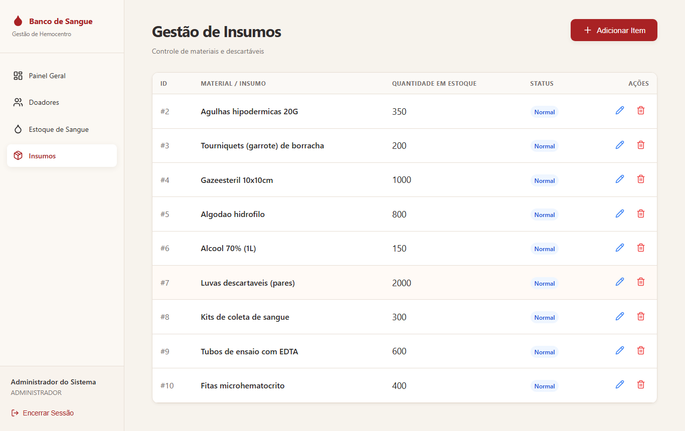

# Avaliação Heurística — Banco de Sangue (TP4, Etapa 1)

> **TP4:** [README](../../README.md) · **Avaliação heurística** · [Melhorias do redesign](../redesign/melhorias-implementadas.md) · [Planejamento da evolução](../evolucao/planejamento.md) · [Acessibilidade](../evolucao/acessibilidade.md) · [Checklist e testes](../checklist-testes-tp4.md) · [CHANGELOG](../../CHANGELOG.md) · [Pull Request #78](https://github.com/AugustoAzev/banco-de-sangue/pull/78)

**Disciplina:** Manutenção e Integração de Software — TP4 (Redesign)
**Sistema avaliado:** versão do `master` após o TP3 (commit `014e608`)
**Data:** 04/10/2026

## 1. Método

- **Base:** as 10 heurísticas de usabilidade de Jakob Nielsen.
- **Objeto:** as cinco telas do sistema (Login, Painel, Doadores, Estoque, Insumos), mais os estados com interação: formulário de doador aberto, envio com erro e diálogo de confirmação.
- **Ambiente:** build de produção (`npm run build && npm start`) ligado ao banco Supabase do grupo, com os dados reais de teste. As capturas foram feitas de forma automatizada (Playwright, janela de 1366×860), para que o "antes" e o "depois" sejam comparáveis. O roteiro está em [`scripts/capturar-evidencias.mjs`](../../scripts/capturar-evidencias.mjs).
- **Severidade** (escala de Nielsen): 0 = não é problema · 1 = cosmético · 2 = pequeno · 3 = grande · 4 = catastrófico (impede a tarefa ou leva a decisão errada).
- **Prioridade de correção:** **Alta** para severidade 3–4 ou problema presente em todas as telas; **Média** para severidade 2; **Baixa** para severidade 1.
- **Lente de acessibilidade:** o objetivo do TP4 é que o sistema possa ser operado por qualquer profissional do hemocentro, inclusive quem tem baixa visão, usa só o teclado ou usa leitor de tela. Por isso cada problema traz também o seu **impacto na acessibilidade**. Os problemas exclusivamente de acessibilidade estão na seção 4 e são tratados na Etapa 2.

## 2. Avaliação por heurística

### H1 — Visibilidade do status do sistema

**Pontos fortes**
- Ações de salvar, excluir e anonimizar dão retorno imediato por aviso (toast) de sucesso ou erro.
- Há mensagens de carregamento ("Atualizando estoque...", "Buscando endereço..." no CEP).
- O item de menu da tela atual fica destacado.

**Pontos fracos**

| ID | Problema | Sev. | Prioridade |
|---|---|---|---|
| P01 | **"Bolsas em Estoque" mostra o número de tipos, não de bolsas.** A API devolve uma linha por tipo sanguíneo e o painel conta as linhas: com 9 bolsas em estoque, o card mostra **6**. | 4 | Alta |
| P02 | **O aviso de estoque crítico não tem critério.** O painel sempre afirma que o tipo com menor contagem "está abaixo do nível de segurança", e o selo "Atenção" aparece sempre, mas não existe nível de segurança definido no sistema. O tipo apontado (B−) também empata com AB−, ambos com zero bolsas, e só um aparece. | 3 | Alta |
| P03 | **"Movimentações Recentes" é um texto fixo.** Sempre diz "Nenhuma movimentação registrada hoje", mesmo depois de entradas registradas. | 3 | Alta (resolvido na Etapa 2, Funcionalidade 1) |
| P06 | **O estoque esconde a falta.** Tipos sem nenhuma bolsa não aparecem na tabela, e a coluna "Status" mostra "Disponível" para qualquer quantidade, sem indicar se o tipo está abaixo do necessário. | 3 | Alta |

| Antes — painel (6 "bolsas") | Antes — estoque (9 bolsas reais) |
|---|---|
|  |  |

**Impacto na acessibilidade:** a informação errada atinge todos os usuários. Para quem usa leitor de tela, que não "passa o olho" na tabela de estoque para conferir, o painel é a principal fonte do resumo, então o erro pesa mais.

### H2 — Correspondência entre o sistema e o mundo real

**Pontos fortes**
- Vocabulário do domínio: doador, triagem, bolsas, hemocomponentes, insumos.
- Tipos sanguíneos na notação usual (A+, O−) na listagem.

**Pontos fracos**

| ID | Problema | Sev. | Prioridade |
|---|---|---|---|
| P05 | **Coluna "ID Lote" sem significado.** Mostra `#3a35ae81...`, o identificador de uma bolsa qualquer do grupo. A tabela agrupa por tipo sanguíneo, não por lote, então o "ID" não corresponde a nada que o usuário reconheça. | 2 | Média |
| P11 | **Perfil exibido como valor técnico.** O menu lateral mostra `ADMINISTRADOR`, o valor do enum do banco. | 1 | Baixa |
| P16 | **Não há como registrar saída de bolsas.** No hemocentro as bolsas saem do estoque por despacho (uso) ou descarte (vencimento, contaminação). O banco já tem esses status (`DESPACHADA`, `DESCARTADA`), mas nenhuma tela os usa: a única opção é **excluir**, o que apaga o registro. | 3 | Alta (resolvido na Etapa 2, Funcionalidade 1) |

**Impacto na acessibilidade:** `ADMINISTRADOR` em maiúsculas é lido letra a letra por alguns leitores de tela. Identificadores como `#3a35ae81...` são lidos caractere por caractere, o que é longo e sem utilidade.

### H3 — Controle e liberdade do usuário

**Pontos fortes**
- Todos os formulários podem ser fechados ou cancelados.
- O diálogo de confirmação fecha com a tecla Esc.

**Pontos fracos**

| ID | Problema | Sev. | Prioridade |
|---|---|---|---|
| P14 | **Confirmações genéricas.** "Excluir este insumo?" e "Tem certeza que deseja excluir este doador?" não dizem **qual** item será afetado. Numa lista de 14 doadores, o usuário não tem como conferir se clicou na linha certa. | 2 | Média |

**Impacto na acessibilidade:** quem usa leitor de tela ou ampliação de tela não vê a linha clicada ao mesmo tempo que o diálogo. A confirmação precisa dizer o nome do item.

### H4 — Consistência e padrões

**Pontos fortes**
- Estrutura comum a todas as telas: menu lateral, cabeçalho com título, subtítulo e ação principal à direita.
- Cores das ações consistentes (editar em azul, excluir em vermelho).

**Pontos fracos**

| ID | Problema | Sev. | Prioridade |
|---|---|---|---|
| P04 | **Card "Coletas Hoje" parece clicável e não leva a lugar nenhum.** Os outros três cards são links; este tem `href="#"` e não faz nada. O valor também é calculado sobre os grupos por tipo, não sobre as bolsas. | 2 | Média |
| P09 | **Formulários com comportamentos diferentes.** No estoque, o botão do cabeçalho vira "Cancelar". Em insumos só há um "X". Em doadores há "X" e "Cancelar". Os títulos têm tamanhos diferentes e os botões usam estilos inline distintos em cada tela. | 2 | Média |
| P10 | **Mesmo dado, rótulos diferentes.** O tipo sanguíneo aparece como "A+" no estoque e como "A +" no formulário de doadores; cada tela tinha a própria função de conversão. | 1 | Baixa |

| Antes — formulário de doador | Antes — insumos |
|---|---|
|  |  |

**Impacto na acessibilidade:** um elemento que se apresenta como link e não faz nada gera uma parada de Tab inútil. Comportamentos diferentes entre telas obrigam a reaprender cada uma, o que pesa mais para quem navega por teclado ou tem limitação cognitiva.

### H5 — Prevenção de erros

**Pontos fortes**
- Confirmação antes de excluir e de anonimizar.
- CPF bloqueado na edição; critérios de triagem e consentimento LGPD obrigatórios.
- Doadores com doações registradas não podem ser excluídos.

**Pontos fracos**

| ID | Problema | Sev. | Prioridade |
|---|---|---|---|
| P07 | **O registro interno do sistema pode ser destruído pela interface.** O doador genérico (CPF `000.000.000-00`), usado em toda entrada manual de estoque, aparece na lista com editar, anonimizar e excluir. Anonimizá-lo remove o CPF, e o [`POST /inventory/bolsas`](../../pages/api/inventory/bolsas.ts) passa a falhar com "Doador genérico (cpf=000.000.000-00) não encontrado". | 4 | Alta |
| P13 | **Quantidades sem limite.** O insumo aceita quantidade negativa; no estoque, a quantidade vazia vira `NaN` e é enviada assim para a API. | 2 | Média |

### H6 — Reconhecimento em vez de memorização

**Pontos fortes**
- Menu lateral sempre visível; os critérios de triagem são listados no próprio formulário.

**Pontos fracos**

| ID | Problema | Sev. | Prioridade |
|---|---|---|---|
| P12 | **Ações só com ícone, quase sem dica.** Das três ações da tabela de doadores, só "anonimizar" tem dica ao passar o mouse; editar e excluir, e as ações de insumos, não têm. O ícone de anonimizar (escudo cortado) não é autoexplicativo. | 2 | Média |

**Impacto na acessibilidade:** sem texto, o leitor de tela anuncia apenas "botão" (25 botões sem nome em Doadores e 18 em Insumos; ver seção 4).

### H7 — Flexibilidade e eficiência de uso

**Pontos fortes**
- Filtro por tipo sanguíneo no estoque.
- O CEP preenche o endereço automaticamente (TP3).

**Pontos fracos**

| ID | Problema | Sev. | Prioridade |
|---|---|---|---|
| P15 | **A lista de doadores não tem busca nem filtro.** Para achar um doador é preciso rolar a lista inteira, que cresce a cada cadastro. | 3 | Alta (resolvido na Etapa 2, Funcionalidade 2) |

### H8 — Estética e design minimalista

**Pontos fortes**
- Telas limpas, com hierarquia visual clara e poucas informações por tela.

**Pontos fracos:** um card vazio fixo (P03) e uma coluna técnica (P05) ocupam espaço sem informar nada. Estão registrados nas heurísticas H1 e H2.

### H9 — Ajudar a reconhecer, diagnosticar e corrigir erros

**Pontos fortes**
- As mensagens da API estão em português e são específicas ("CPF deve conter 11 dígitos", "CPF já cadastrado").

**Pontos fracos**

| ID | Problema | Sev. | Prioridade |
|---|---|---|---|
| P08 | **O erro aparece longe do campo e some sozinho.** No cadastro de doador, o erro surge num aviso no topo da tela, longe do campo, e desaparece em 6 segundos. O botão "Cadastrar" fica no fim do formulário, então o campo com problema está fora da vista. O formulário não indica qual campo corrigir. | 3 | Alta |

| Antes — erro no envio | Antes — 6 segundos depois |
|---|---|
|  |  |

**Impacto na acessibilidade:** um aviso temporário é pior para quem lê devagar, usa ampliação de tela (o aviso fica fora da área ampliada) ou leitor de tela (a mensagem não fica ligada ao campo).

### H10 — Ajuda e documentação

**Pontos fortes**
- Os critérios de triagem e o termo de consentimento LGPD explicam a regra em linguagem clara.

**Pontos fracos**

| ID | Problema | Sev. | Prioridade |
|---|---|---|---|
| P17 | **Falta orientação no próprio campo.** Não se informa que cada unidade do estoque é uma bolsa de 450 mL, qual o limite que torna um insumo "Baixo Estoque" (10 unidades), nem que o CEP preenche o endereço ao sair do campo. | 1 | Baixa |

## 3. Resumo priorizado

| ID | Heurística | Problema | Sev. | Prioridade | Onde é tratado |
|---|---|---|---|---|---|
| P01 | H1 | Total de bolsas errado no painel | 4 | Alta | Etapa 1 |
| P07 | H5 | Registro do sistema exposto a exclusão/anonimização | 4 | Alta | Etapa 1 |
| P02 | H1 | Aviso de estoque crítico sem critério | 3 | Alta | Etapa 1 |
| P06 | H1 | Estoque esconde tipos zerados; status sempre "Disponível" | 3 | Alta | Etapa 1 |
| P08 | H9 | Erro longe do campo e temporário | 3 | Alta | Etapa 1 (visual) + Etapa 2 (leitor de tela) |
| P03 | H1 | "Movimentações Recentes" fixo | 3 | Alta | Etapa 2 — Funcionalidade 1 |
| P16 | H2/H3 | Sem registro de saída (só exclusão) | 3 | Alta | Etapa 2 — Funcionalidade 1 |
| P15 | H7 | Sem busca de doadores | 3 | Alta | Etapa 2 — Funcionalidade 2 |
| P04 | H4 | Card "Coletas Hoje" falso link e cálculo errado | 2 | Média | Etapa 1 |
| P05 | H2 | Coluna "ID Lote" técnica | 2 | Média | Etapa 1 |
| P09 | H4 | Formulários inconsistentes | 2 | Média | Etapa 1 |
| P12 | H6 | Ações só com ícone | 2 | Média | Etapa 1 (dica visual) + Etapa 2 (nome acessível) |
| P13 | H5 | Quantidades negativas ou vazias | 2 | Média | Etapa 1 |
| P14 | H3 | Confirmações genéricas | 2 | Média | Etapa 1 |
| P10 | H4 | Rótulos diferentes de tipo sanguíneo | 1 | Baixa | Etapa 1 |
| P11 | H2 | Perfil como valor de enum | 1 | Baixa | Etapa 1 |
| P17 | H10 | Falta orientação nos campos | 1 | Baixa | Etapa 1 |

As mudanças da Etapa 1 estão em [`melhorias-implementadas.md`](./melhorias-implementadas.md).

## 4. Achados de acessibilidade (base para a Etapa 2)

Medidos no mesmo estado "antes", com Lighthouse (categoria Acessibilidade) e axe-core (regras WCAG 2.1 níveis A e AA). Dados brutos em [`../evolucao/evidencias/relatorio-antes.json`](../evolucao/evidencias/relatorio-antes.json).

| Tela | Lighthouse | Violações axe (elementos afetados) |
|---|---|---|
| Login | 96 | contraste (2) |
| Painel | 96 | contraste (7) |
| Doadores | 90 | botão sem nome (25), contraste (2) |
| Doadores — formulário aberto | — | botão sem nome (26), campo sem rótulo (5), lista de seleção sem rótulo (2), contraste (2) |
| Estoque | 92 | lista de seleção sem rótulo (1), contraste (2) |
| Insumos | 90 | botão sem nome (18), contraste (2) |

Testes de teclado:
- São necessários **6 Tabs** para chegar ao botão "Novo Doador", porque todo o menu vem antes.
- Ao abrir o diálogo de confirmação pelo teclado, **o foco fica no botão da tabela, atrás do diálogo**. Quem usa só teclado continua navegando pela página escondida.

Esses pontos, junto com o contraste do texto secundário, são o problema de acessibilidade tratado na Etapa 2 ([`../evolucao/acessibilidade.md`](../evolucao/acessibilidade.md)).
