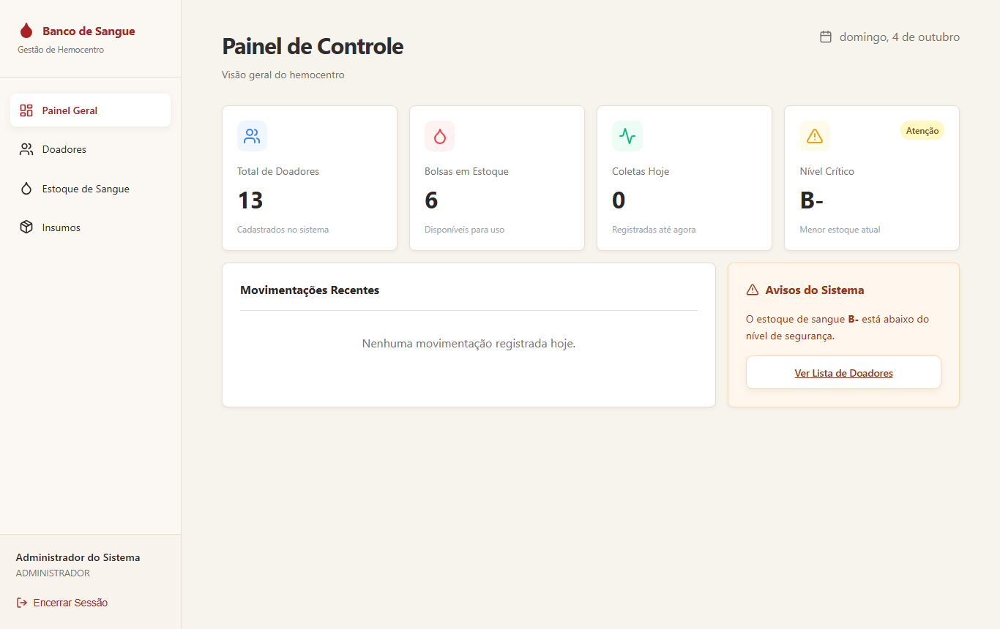
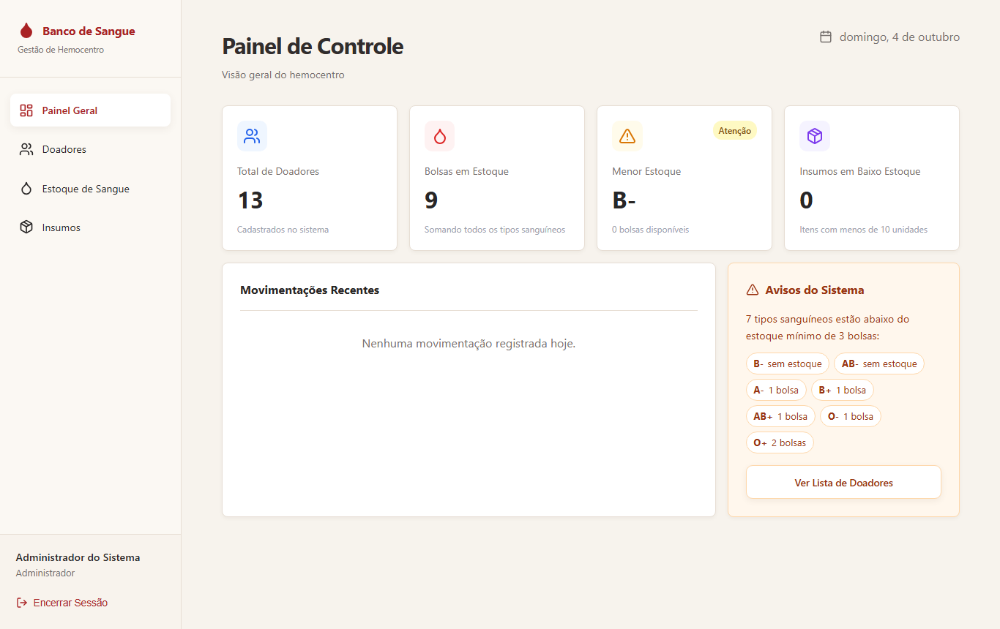
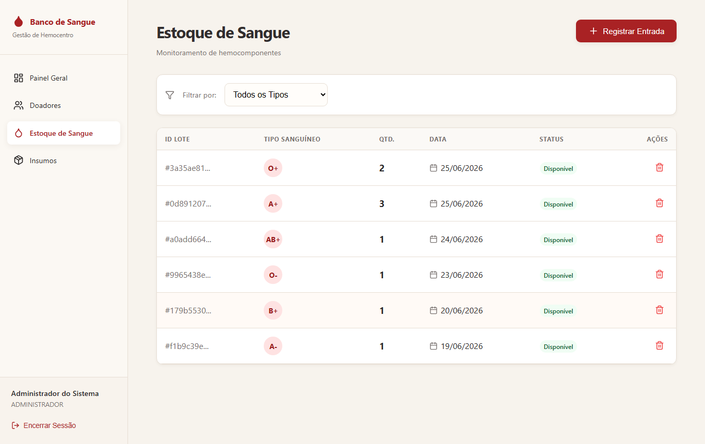
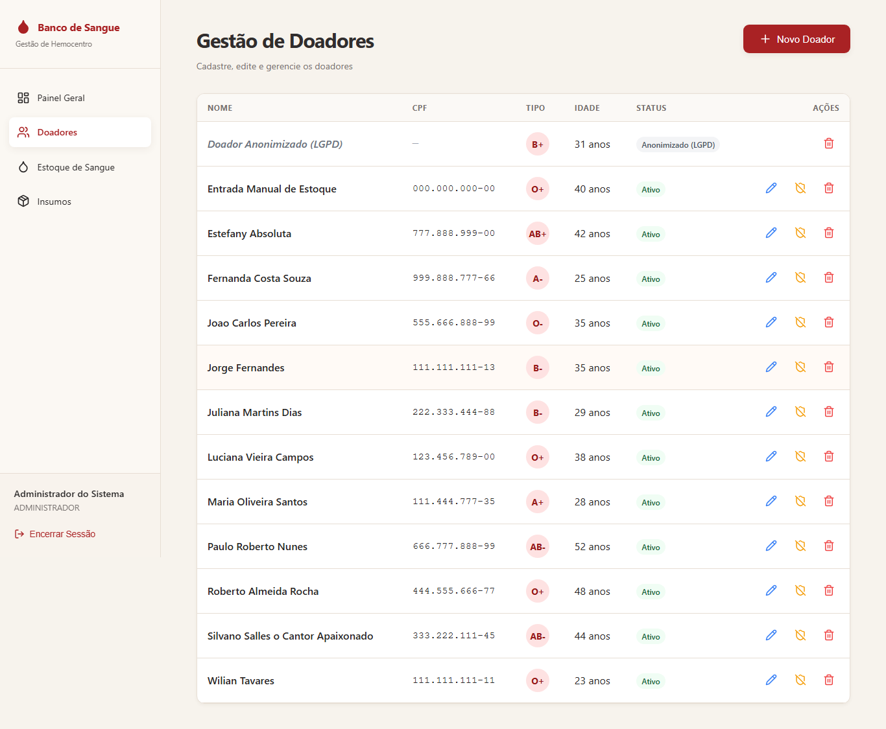
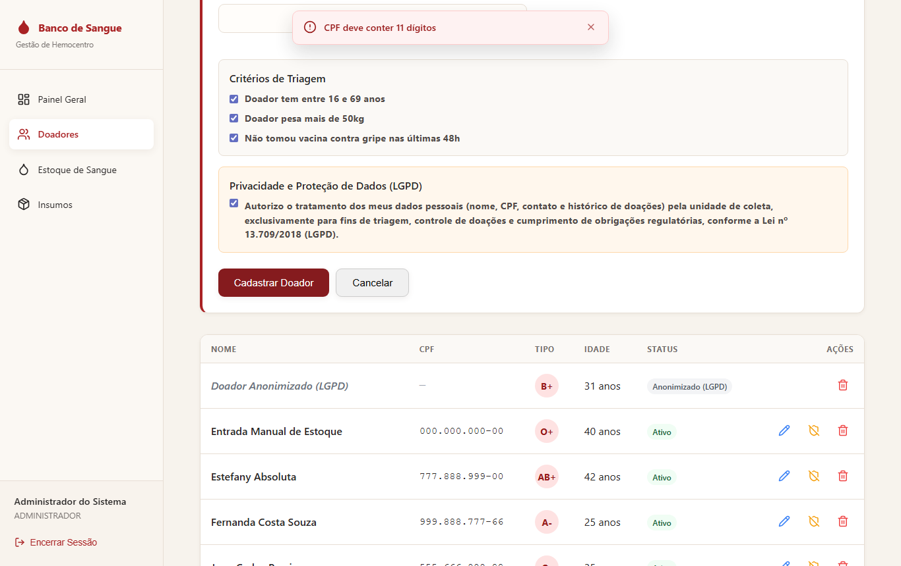
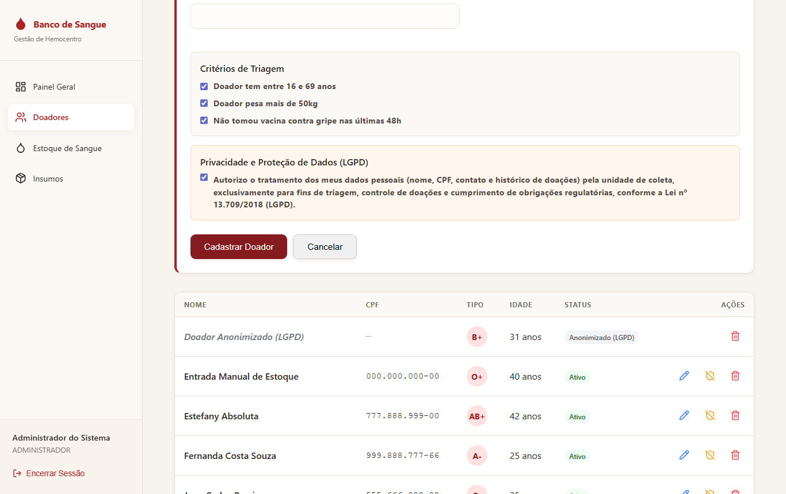
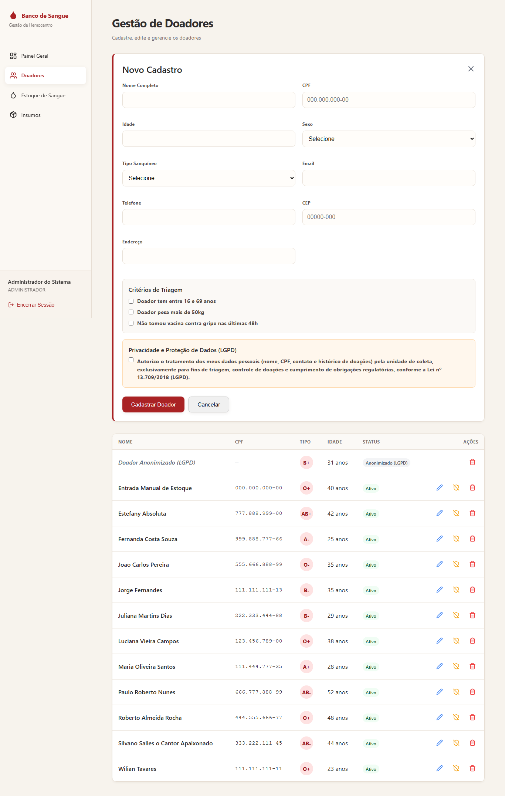
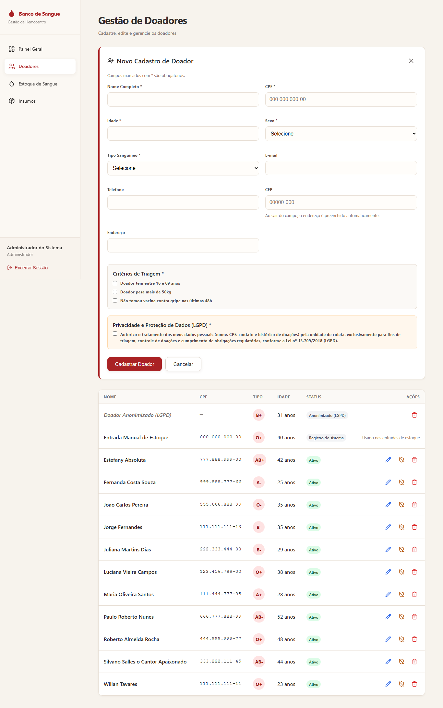
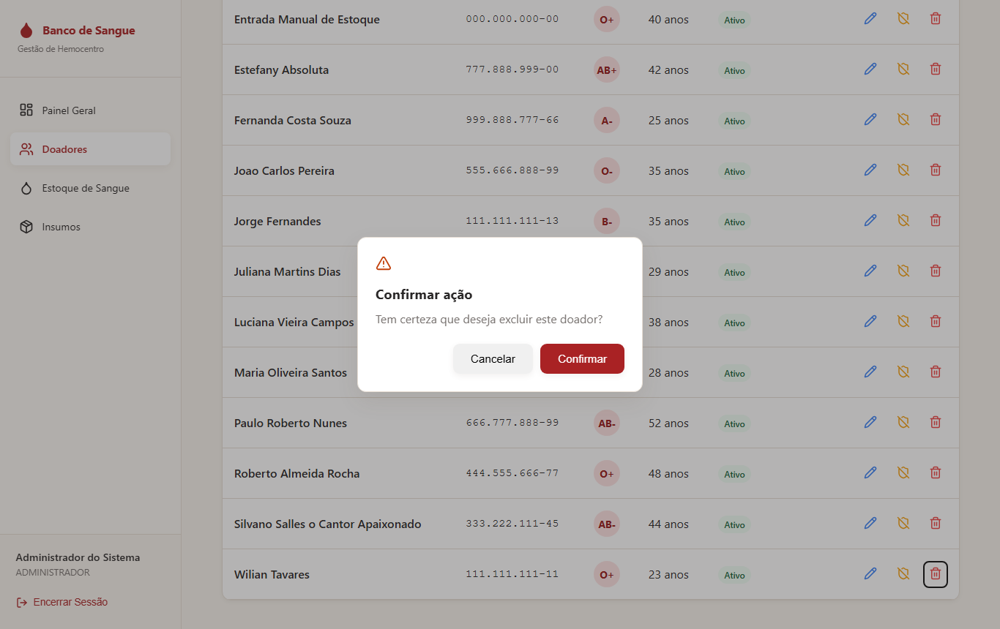
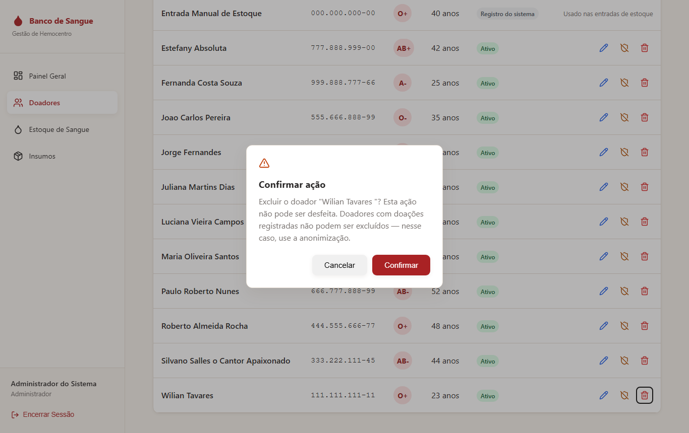

# Melhorias Implementadas — Redesign (TP4, Etapa 1)

Cada mudança abaixo corrige um ou mais problemas da [avaliação heurística](./avaliacao-heuristica.md) (IDs `P01`…`P17`) e indica a heurística de Nielsen que ela aplica. Todas as capturas "antes" e "depois" foram feitas com o mesmo roteiro automatizado, sobre o mesmo banco de dados, para serem comparáveis.

**Commit:** `feat(redesign): aplicar heuristicas de Nielsen nas telas existentes (TP4 etapa 1)`
**Escopo:** manutenção das telas existentes. Nenhuma tela nova e nenhuma mudança no modelo de dados.

## Resumo

| # | Mudança | Problemas | Heurística |
|---|---|---|---|
| M01 | Painel com números corretos e aviso de estoque baseado em critério | P01, P02, P04 | H1, H4 |
| M02 | Estoque mostra todos os tipos e a situação de cada um | P05, P06 | H1, H2, H8 |
| M03 | Registro interno do sistema protegido | P07 | H5 |
| M04 | Erros do formulário junto ao campo | P08 | H9 |
| M05 | Formulários e componentes padronizados | P09, P10 | H4 |
| M06 | Dicas nos botões de ícone | P12 | H6 |
| M07 | Quantidades validadas antes do envio | P13 | H5 |
| M08 | Confirmações que dizem qual item será afetado | P14 | H3, H5 |
| M09 | Perfil do usuário em linguagem comum | P11 | H2 |
| M10 | Orientações dentro dos campos | P17 | H10 |

Os problemas P03, P15 e P16 dependem de funcionalidades novas e são resolvidos na Etapa 2 ([planejamento](../evolucao/planejamento.md)).

---

## M01 — Painel com números corretos (H1, H4)

**Problema (P01, P02, P04):**
- O card "Bolsas em Estoque" contava as linhas da resposta agrupada por tipo e mostrava **6** com **9** bolsas em estoque.
- O aviso afirmava que um tipo estava "abaixo do nível de segurança" sem que existisse nível definido.
- O card "Coletas Hoje" parecia um link e não levava a lugar nenhum.

**Mudança:**
- **Total correto:** o painel soma as quantidades de todos os tipos.
- **Estoque mínimo definido:** foi criada a política `src/lib/inventory-policy.ts`, com mínimo de 3 bolsas por tipo, ponto único de manutenção como o `donor-eligibility.ts` do TP anterior.
- **"Menor Estoque" com a quantidade:** o card mostra o tipo e quantas bolsas há ("B− · 0 bolsas disponíveis").
- **Aviso só quando há motivo:** o "Avisos do Sistema" lista **todos** os tipos abaixo do mínimo, com a quantidade de cada um. Se nenhum estiver abaixo, mostra uma mensagem verde de que o estoque está adequado. O selo "Atenção" só aparece quando há problema.
- **Card de insumos no lugar de "Coletas Hoje":** "Coletas Hoje" saiu, porque o sistema registra entradas de estoque, não coletas por doador, e o valor era calculado errado. No lugar entrou "Insumos em Baixo Estoque", que leva à tela de insumos. Agora os quatro cards são links que funcionam.

| Antes | Depois |
|---|---|
|  |  |

**Arquivos:** `app/(protected)/dashboard/page.tsx`, `src/lib/inventory-policy.ts`.
**Teste:** `tests/redesign-painel-estoque.test.ts` reproduz o estoque real da captura (9 bolsas em 6 tipos) e garante que o total é 9.

## M02 — Estoque mostra todos os tipos e a situação (H1, H2, H8)

**Problema (P05, P06):** tipos sem bolsas sumiam da tabela; o status era sempre "Disponível"; a coluna "ID Lote" mostrava o identificador de uma bolsa qualquer.

**Mudança:**
- **Todos os tipos na tabela:** os 8 tipos aparecem sempre, e a falta de estoque fica visível.
- **Coluna "Situação":** mostra **Adequado**, **Abaixo do mínimo** ou **Sem estoque**, sempre em texto, nunca só pela cor.
- **Colunas com significado:** "ID Lote" deu lugar a "Bolsas Disponíveis" e "Última Entrada".
- **Mínimo visível:** o estoque mínimo da política aparece ao lado do filtro.

| Antes | Depois |
|---|---|
|  |  |

**Arquivos:** `app/(protected)/estoque/page.tsx`.

## M03 — Registro interno do sistema protegido (H5)

**Problema (P07):** o doador genérico (CPF `000.000.000-00`), usado em toda entrada manual de estoque, podia ser editado, anonimizado ou excluído pela lista. Anonimizá-lo quebrava o registro de novas bolsas.

**Mudança:**
- **Na tela:** o registro aparece com o selo **"Registro do sistema"** e a nota "Usado nas entradas de estoque", sem botões de ação.
- **Na API:** `PUT` e `DELETE /api/donors/{id}` e `PATCH /api/donors/{id}/anonymize` passam a recusar esse registro com `409`. A proteção não depende só da interface.
- **Identificação centralizada:** a regra que reconhece esse doador está em `src/lib/system-records.ts`, também usado pelo `POST /inventory/bolsas`.

| Antes | Depois |
|---|---|
|  |  |

**Arquivos:** `src/lib/system-records.ts`, `pages/api/donors/[id].ts`, `pages/api/donors/[id]/anonymize.ts`, `pages/api/inventory/bolsas.ts`, `app/(protected)/doadores/page.tsx`.
**Teste:** `tests/redesign-doadores.test.ts` cobre as três rotas recusando o registro (`409`) sem chegar a gravar no banco.

## M04 — Erros junto ao campo (H9)

**Problema (P08):** o erro aparecia num aviso no topo da tela, longe do campo, e sumia em 6 segundos; o campo com problema ficava fora da vista.

**Mudança:**
- **Validação antes do envio:** o formulário valida antes de enviar, com as mesmas regras de idade de `donor-eligibility.ts`.
- **Mensagem junto do campo:** cada erro aparece **abaixo do próprio campo**, com borda vermelha e o símbolo ⚠, e diz como corrigir ("O CPF deve ter 11 dígitos (foram informados 3)").
- **A mensagem fica até a correção:** só some quando o campo é corrigido.
- **Rolagem até o erro:** depois do envio, a tela rola até o primeiro campo com erro.
- **Erros do servidor no campo certo:** quando a mensagem se refere a um campo, como "CPF já cadastrado", ela também aparece junto dele.

| Antes — no envio | Antes — 6 s depois | Depois — 6 s depois |
|---|---|---|
|  |  |  |

**Arquivos:** `src/lib/donor-form-validation.ts`, `app/(protected)/doadores/page.tsx`.
**Teste:** `tests/redesign-doadores.test.ts` (validação e associação de erros da API ao campo).

## M05 — Formulários e componentes padronizados (H4)

**Problema (P09, P10):** cada tela tinha botões, títulos e formas de fechar o formulário diferentes, e o tipo sanguíneo aparecia como "A+" numa tela e "A +" em outra.

**Mudança:**
- **Mesmo comportamento nas três telas:** ao abrir o formulário, o botão do cabeçalho some. O formulário tem título com ícone, botão de fechar no canto e, no rodapé, a ação principal e "Cancelar".
- **Estilos compartilhados:** classes comuns em `app/globals.css` (`.btn-secondary`, `.icon-btn`, `.form-card`, `.field-error`, selos) substituem os estilos inline de cada tela.
- **Um só rótulo para o tipo sanguíneo:** a conversão do tipo foi para `src/lib/blood-types.ts` e é usada por todas as telas.

| Antes — doador | Depois — doador |
|---|---|
|  |  |

**Arquivos:** `app/globals.css`, `src/lib/blood-types.ts`, as três telas.

## M06 — Dicas nos botões de ícone (H6)

**Problema (P12):** editar e excluir eram só ícones, sem dica.

**Mudança:** todas as ações de ícone ganharam dica ao passar o mouse ("Editar doador", "Anonimizar dados (LGPD)", "Excluir doador", "Excluir insumo", "Fechar formulário"). A versão para leitor de tela, com o nome do item ("Excluir doador Maria Oliveira Santos"), faz parte da Etapa 2.

## M07 — Quantidades validadas (H5)

**Problema (P13):** insumo aceitava quantidade negativa; quantidade vazia no estoque virava `NaN`.

**Mudança:** os campos de quantidade só aceitam inteiros (≥ 1 no estoque, ≥ 0 em insumos) e mostram o erro junto do campo, como em M04.

## M08 — Confirmações específicas (H3, H5)

**Problema (P14):** "Excluir este insumo?" não dizia qual.

**Mudança:**
- **O item aparece na confirmação:** as mensagens citam o nome ("Excluir o doador "Maria Oliveira Santos"? Esta ação não pode ser desfeita…").
- **Consequência e alternativa:** a mensagem explica o que acontece e, quando há, aponta outro caminho. Doadores com doações devem ser anonimizados; a exclusão de lote de bolsas serve "apenas para corrigir um lançamento feito por engano".

| Antes | Depois |
|---|---|
|  |  |

## M09 — Perfil em linguagem comum (H2)

**Problema (P11):** o menu mostrava `ADMINISTRADOR`. **Mudança:** mostra "Administrador" ou "Atendente" (`app/(protected)/layout.tsx`).

## M10 — Orientações nos campos (H10)

**Problema (P17):** faltava orientação no próprio campo.

**Mudança:**
- **Estoque:** "Cada unidade corresponde a uma bolsa de 450 mL".
- **Insumos:** "Abaixo de 10 unidades o item aparece como baixo estoque".
- **CEP:** "Ao sair do campo, o endereço é preenchido automaticamente".
- **Doador:** "Campos marcados com * são obrigatórios", e o CPF na edição explica que não pode ser alterado.

---

## Evidências quantitativas

**Testes automatizados:** de 33 para **53**, com dois arquivos novos de teste do redesign. O `next build` e o `tsc --noEmit` passam sem erros.

**Efeito colateral na acessibilidade:** as dicas de M06 também dão nome aos botões para o leitor de tela, então a nota de acessibilidade do Lighthouse subiu nas telas com ações de ícone:

| Tela | Antes | Depois do redesign |
|---|---|---|
| Doadores | 90 | 96 |
| Insumos | 90 | 96 |
| Painel | 96 | 96 |
| Estoque | 92 | 92 |
| Login | 96 | 96 |

Continuam pendentes o contraste, os rótulos dos campos, o foco do diálogo e a navegação por teclado, que são o objeto da [melhoria de acessibilidade da Etapa 2](../evolucao/acessibilidade.md). Dados brutos: [`relatorio-pos-redesign.json`](../evolucao/evidencias/relatorio-pos-redesign.json).
