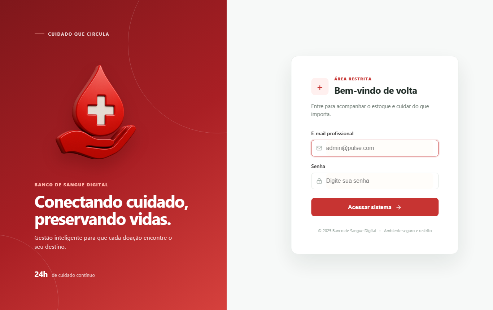
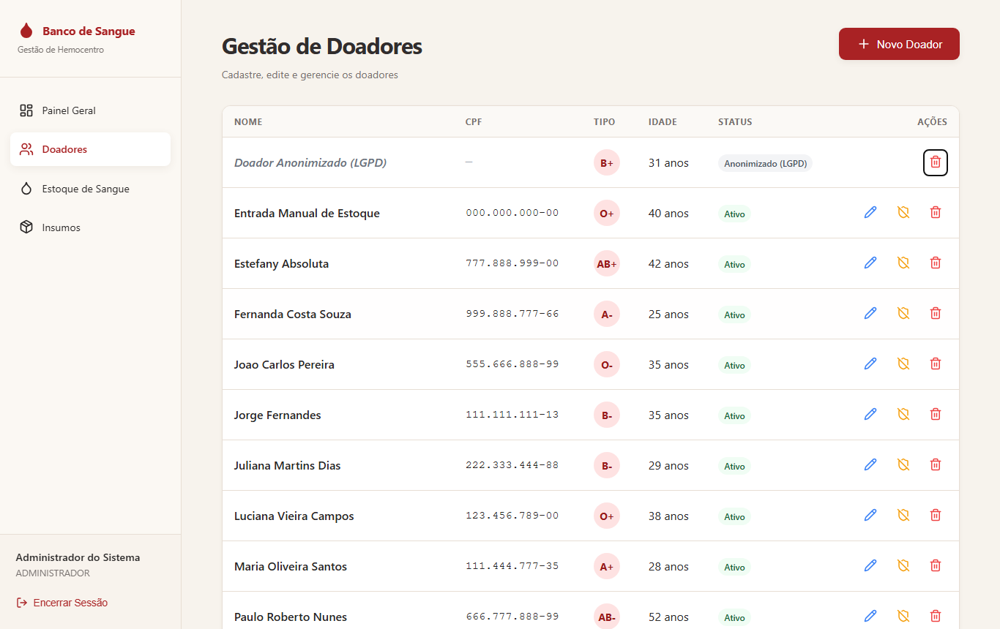

# Capturas — ANTES do TP4 (sistema original)

> Parte do TP4 · [Relatório do TP4](../../../../RELATORIO-TP4.md) · [Avaliação heurística](../../avaliacao-heuristica.md) · Próximo estado: [depois do redesign](../depois-do-redesign/) → [estado final](../../../evolucao/screenshots/estado-final/)

Este é o sistema **antes de qualquer mudança do TP4**. As capturas foram feitas sobre o commit [`014e608`](https://github.com/AugustoAzev/banco-de-sangue/commit/014e608) (versão do `master` após o TP3), com o build de produção, o banco real do grupo e uma janela de 1366×860. As mesmas capturas foram repetidas nos estados seguintes, com os mesmos nomes, para comparar lado a lado.

| Arquivo | O que mostra | Problema da avaliação |
|---|---|---|
| [`01-login.png`](./01-login.png) | Tela de login | Texto de apresentação e rodapé com contraste abaixo de 4,5:1 ([achados de acessibilidade](../../avaliacao-heuristica.md#4-achados-de-acessibilidade-base-para-a-etapa-2)) |
| [`02-dashboard.png`](./02-dashboard.png) | Painel: **"Bolsas em Estoque: 6"** com 9 bolsas reais; aviso de "nível de segurança" sem critério; "Movimentações Recentes" fixo; card "Coletas Hoje" que não leva a lugar nenhum | [P01, P02, P03](../../avaliacao-heuristica.md#h1--visibilidade-do-status-do-sistema), [P04](../../avaliacao-heuristica.md#h4--consistência-e-padrões) |
| [`03-doadores.png`](./03-doadores.png) | Lista de doadores: o registro do sistema "Entrada Manual de Estoque" com editar, anonimizar e excluir; ações só com ícone | [P07](../../avaliacao-heuristica.md#h5--prevenção-de-erros), [P12](../../avaliacao-heuristica.md#h6--reconhecimento-em-vez-de-memorização) |
| [`04-estoque.png`](./04-estoque.png) | Estoque: só os 6 tipos que têm bolsas (soma 9), coluna "ID Lote" técnica, status sempre "Disponível" | [P05](../../avaliacao-heuristica.md#h2--correspondência-entre-o-sistema-e-o-mundo-real), [P06](../../avaliacao-heuristica.md#h1--visibilidade-do-status-do-sistema) |
| [`05-insumos.png`](./05-insumos.png) | Insumos: ações de editar e excluir só com ícone, sem dica | [P12](../../avaliacao-heuristica.md#h6--reconhecimento-em-vez-de-memorização) |
| [`06-doadores-formulario.png`](./06-doadores-formulario.png) | Formulário de cadastro de doador original | [P09](../../avaliacao-heuristica.md#h4--consistência-e-padrões) |
| [`07-doadores-erro-cpf.png`](./07-doadores-erro-cpf.png) | Envio com CPF de 3 dígitos: o erro aparece num aviso no topo, longe do campo | [P08](../../avaliacao-heuristica.md#h9--ajudar-a-reconhecer-diagnosticar-e-corrigir-erros) |
| [`08-doadores-erro-apos-6s.png`](./08-doadores-erro-apos-6s.png) | O mesmo envio 6 segundos depois: a mensagem de erro sumiu | [P08](../../avaliacao-heuristica.md#h9--ajudar-a-reconhecer-diagnosticar-e-corrigir-erros) |
| [`09-teclado-foco-acao.png`](./09-teclado-foco-acao.png) | Foco por teclado no primeiro botão de ação da tabela; o leitor de tela anuncia só "botão" (sem nome) | [Achados de acessibilidade](../../avaliacao-heuristica.md#4-achados-de-acessibilidade-base-para-a-etapa-2) |
| [`10-dialogo-confirmacao.png`](./10-dialogo-confirmacao.png) | Diálogo "Excluir?" aberto pelo teclado: o foco fica na lixeira, **atrás** do diálogo; mensagem genérica, sem o nome do doador | [P14](../../avaliacao-heuristica.md#h3--controle-e-liberdade-do-usuário) e achados de acessibilidade |
| [`11-primeiro-tab.png`](./11-primeiro-tab.png) | O primeiro Tab vai para o menu ("Painel Geral"): não há atalho para o conteúdo | [Achados de acessibilidade](../../avaliacao-heuristica.md#4-achados-de-acessibilidade-base-para-a-etapa-2) |
| [`12-foco-campo.png`](./12-foco-campo.png) | Campo "Nome Completo" com foco: só uma sombra quase invisível | [Achados de acessibilidade](../../avaliacao-heuristica.md#4-achados-de-acessibilidade-base-para-a-etapa-2) |

Medições deste estado (Lighthouse, axe, teclado): [`relatorio-antes.json`](../../../evolucao/evidencias/relatorio-antes.json).

## Galeria

### 02 — Painel (total de bolsas errado)

### 04 — Estoque (só 6 tipos, "ID Lote", sempre "Disponível")

### 03 — Doadores (registro do sistema com ações)

### 07 e 08 — Erro de CPF longe do campo e que some

### 10 — Diálogo com o foco fora dele

### 01, 05, 06, 09, 11 e 12

