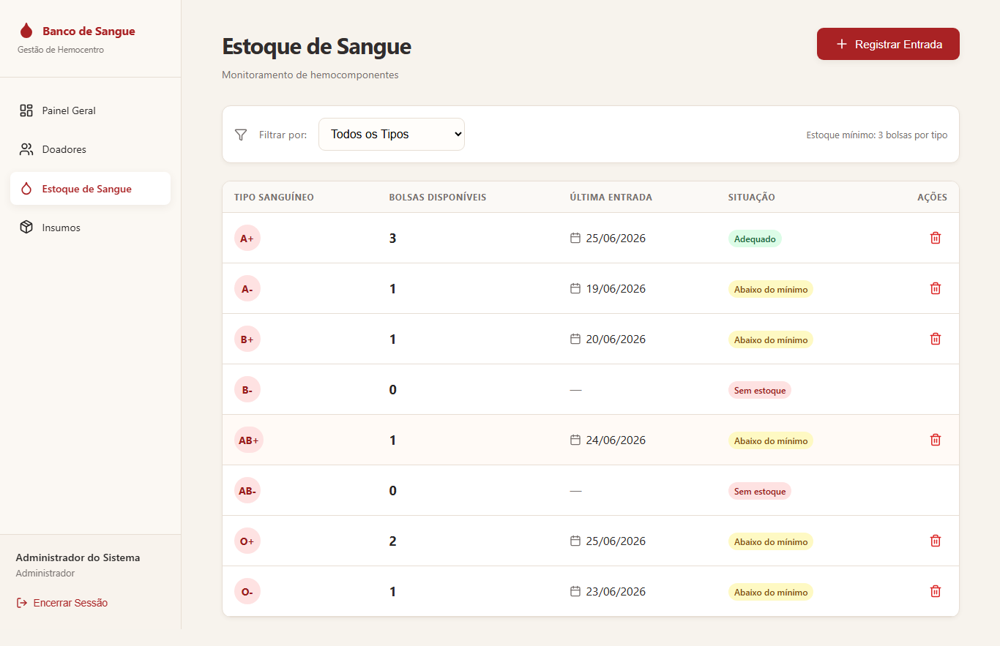
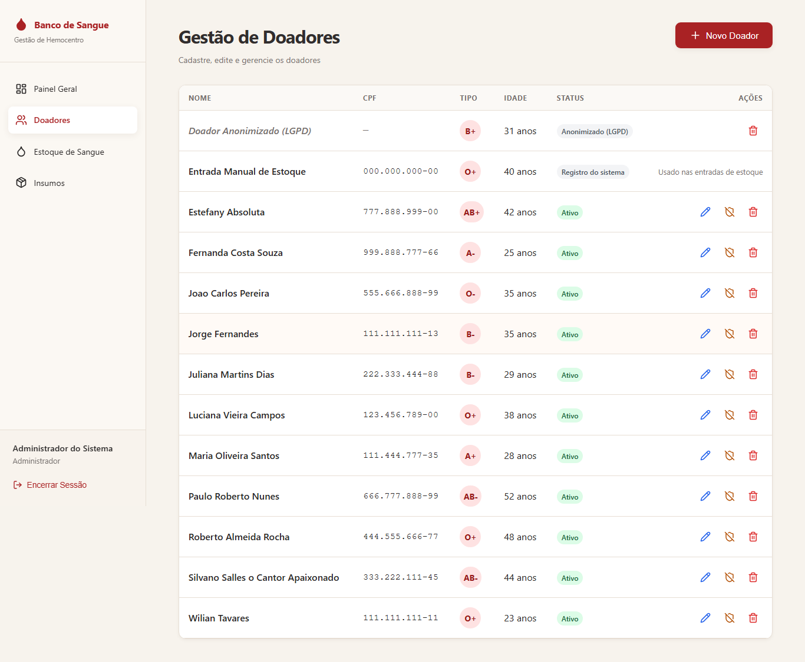
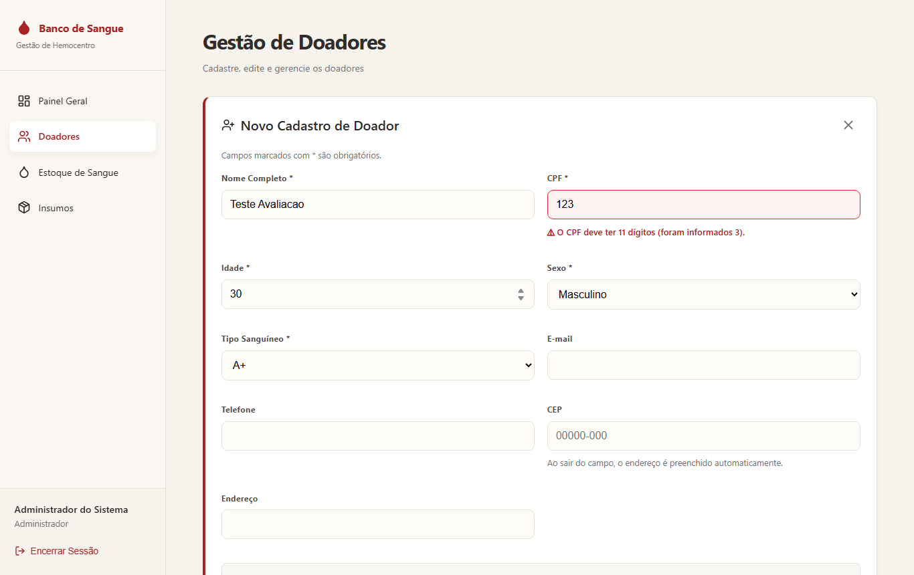
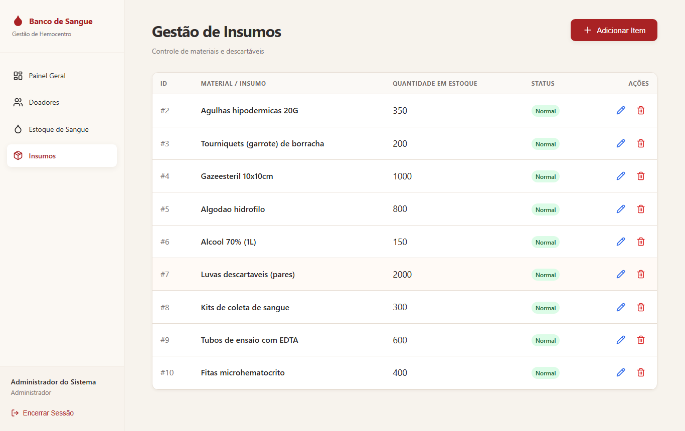
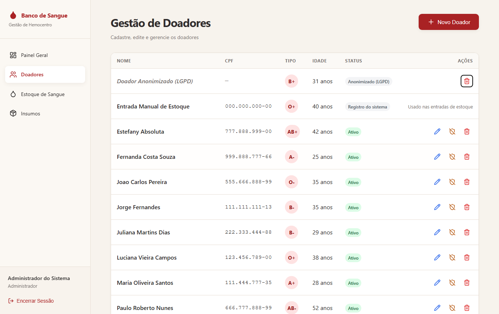

# Capturas — DEPOIS DO REDESIGN (fim da Etapa 1)

> Parte do TP4 · [Relatório do TP4](../../../../RELATORIO-TP4.md) · [Melhorias do redesign](../../melhorias-implementadas.md) · Estado anterior: [antes](../antes/) · Próximo estado: [estado final](../../../evolucao/screenshots/estado-final/)

O sistema **depois da Etapa 1 (redesign) e antes da Etapa 2**. Mesmo roteiro e mesmo banco das capturas [antes](../antes/), commit [`40ab87d`](https://github.com/AugustoAzev/banco-de-sangue/commit/40ab87d4cdf9233c702df28bbbfff06d7dc1eadd). Ainda não existem as funcionalidades novas nem a melhoria de acessibilidade: o card "Movimentações Recentes" continua fixo, e rótulos, contraste e foco ainda são os originais. Esta pasta isola **o efeito do redesign**. Para ver o sistema como ficou no fim do TP4, abra o [estado final](../../../evolucao/screenshots/estado-final/).

| Arquivo | O que mostra | Mudança do redesign |
|---|---|---|
| [`01-login.png`](./01-login.png) | Login (sem mudança na Etapa 1) | — |
| [`02-dashboard.png`](./02-dashboard.png) | Painel com **9 bolsas** (soma correta), "Menor Estoque B− · 0 bolsas", avisos listando os 7 tipos abaixo do mínimo de 3, card "Insumos em Baixo Estoque" | [M01](../../melhorias-implementadas.md#m01--painel-com-números-corretos-h1-h4) |
| [`03-doadores.png`](./03-doadores.png) | Registro do sistema com o selo "Registro do sistema" e sem ações | [M03](../../melhorias-implementadas.md#m03--registro-interno-do-sistema-protegido-h5) |
| [`04-estoque.png`](./04-estoque.png) | Os 8 tipos, inclusive os zerados, com a situação de cada um; sem "ID Lote"; estoque mínimo visível | [M02](../../melhorias-implementadas.md#m02--estoque-mostra-todos-os-tipos-e-a-situação-h1-h2-h8) |
| [`05-insumos.png`](./05-insumos.png) | Insumos com botões padronizados e dicas | [M05](../../melhorias-implementadas.md#m05--formulários-e-componentes-padronizados-h4), [M06](../../melhorias-implementadas.md#m06--dicas-nos-botões-de-ícone-h6) |
| [`06-doadores-formulario.png`](./06-doadores-formulario.png) | Formulário no padrão comum: título com ícone, "*" nos obrigatórios, dica do CEP | [M05](../../melhorias-implementadas.md#m05--formulários-e-componentes-padronizados-h4), [M10](../../melhorias-implementadas.md#m10--orientações-nos-campos-h10) |
| [`07-doadores-erro-cpf.png`](./07-doadores-erro-cpf.png) | Erro de CPF **junto do campo**, com a tela levada até ele | [M04](../../melhorias-implementadas.md#m04--erros-junto-ao-campo-h9) |
| [`08-doadores-erro-apos-6s.png`](./08-doadores-erro-apos-6s.png) | 6 segundos depois: o erro **continua** visível | [M04](../../melhorias-implementadas.md#m04--erros-junto-ao-campo-h9) |
| [`09-teclado-foco-acao.png`](./09-teclado-foco-acao.png) | Foco na primeira ação da tabela. O botão ganhou a dica "Excluir doador" ao passar o mouse; o nome com o doador, para o leitor de tela, vem na Etapa 2 | [M06](../../melhorias-implementadas.md#m06--dicas-nos-botões-de-ícone-h6) |
| [`10-dialogo-confirmacao.png`](./10-dialogo-confirmacao.png) | Confirmação que cita o nome do doador e explica a consequência | [M08](../../melhorias-implementadas.md#m08--confirmações-específicas-h3-h5) |

Medições deste estado: [`relatorio-pos-redesign.json`](../../../evolucao/evidencias/relatorio-pos-redesign.json).

## Galeria

### 02 — Painel

### 04 — Estoque

### 03 — Doadores

### 07 e 08 — Erro junto do campo e persistente

### 10 — Confirmação específica

### 01, 05, 06 e 09

