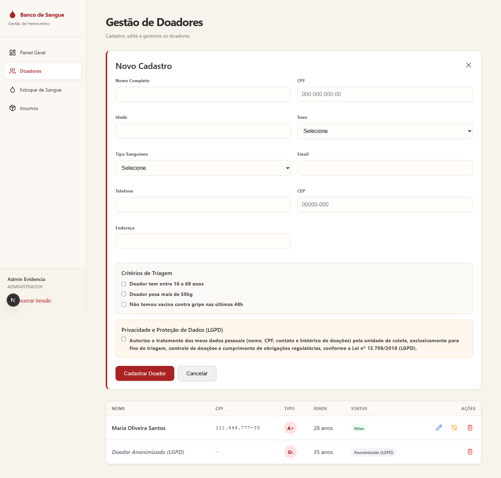
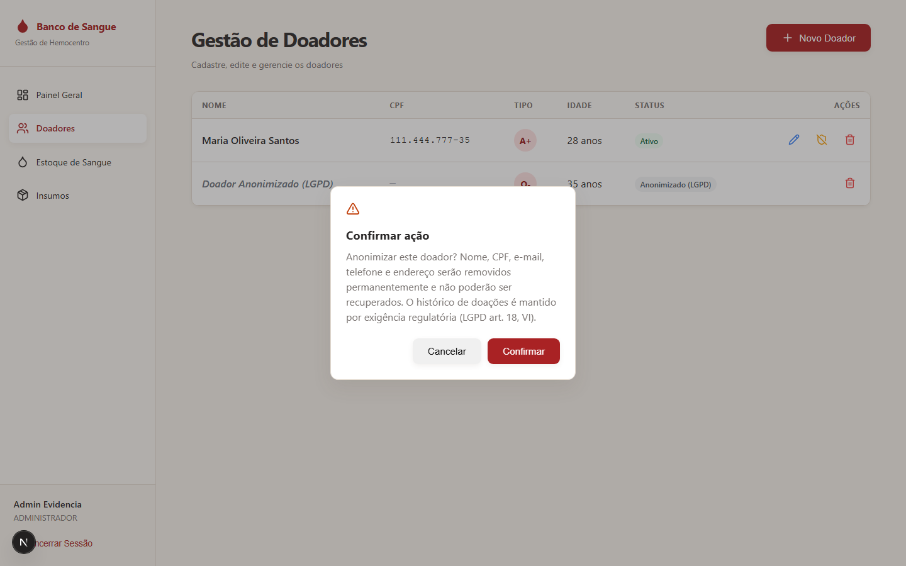
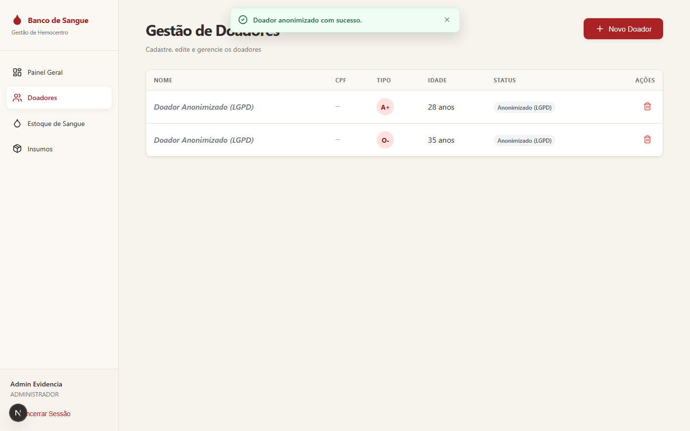

# Evidência 2 — Cenário de Mudança de Regulamentação (LGPD)

## Funcionalidades adaptadas

O sistema armazena dados pessoais sensíveis de doadores (CPF, nome, contato, tipo sanguíneo, histórico de doações). Duas funcionalidades foram adaptadas para responder à Lei nº 13.709/2018 (LGPD):

1. **Consentimento explícito no cadastro de doador** (LGPD art. 8º — o consentimento deve ser fornecido por escrito ou por outro meio que demonstre a manifestação de vontade do titular).
2. **Anonimização de dados em vez de exclusão definitiva** (LGPD art. 18, VI — direito à eliminação dos dados tratados com consentimento, exceto nas hipóteses do art. 16, que incluem cumprimento de obrigação legal/regulatória — o setor de hemoterapia é regulado pela ANVISA e possui exigências de rastreabilidade e retenção de histórico de doações).

## Antes da adaptação

- O formulário de cadastro de doador (`app/(protected)/doadores/page.tsx`) não coletava nenhum tipo de consentimento — qualquer doador podia ser cadastrado sem manifestação de vontade registrada.
- A única forma de remoção (`DELETE /api/donors/[id]`) era exclusão definitiva (hard delete), e ficava **bloqueada** quando o doador já tinha doações associadas (`'Doador possui doações associadas e não pode ser excluído'`) — ou seja, doadores com histórico não tinham *nenhum* caminho para exercer direito de remoção de dados pessoais.

## Adaptação implementada

### 1. Migration aditiva (`supabase_migration.sql`)

```sql
ALTER TABLE doadores
  ADD COLUMN IF NOT EXISTS consentimento_lgpd    BOOLEAN     NOT NULL DEFAULT FALSE,
  ADD COLUMN IF NOT EXISTS consentimento_lgpd_em TIMESTAMPTZ,
  ADD COLUMN IF NOT EXISTS anonimizado_em         TIMESTAMPTZ;
```

Registros legados ficam com `consentimento_lgpd = FALSE` (não presumimos consentimento retroativo), mesmo que o tratamento já seja legítimo por obrigação legal (LGPD art. 7º, II).

### 2. Backend — consentimento obrigatório no cadastro (`pages/api/donors/index.ts`)

```ts
if (!condicao_1 || !condicao_2 || !condicao_3) {
  return res.status(400).json({ detail: 'Doador não atende aos critérios de triagem' });
}
if (!consentimento_lgpd) {
  return res.status(400).json({ detail: 'É necessário o consentimento do doador para o tratamento de dados pessoais (LGPD)' });
}
```

`POST /donors` agora grava `consentimento_lgpd: true` e `consentimento_lgpd_em: <timestamp>` junto com o registro.

### 3. Backend — anonimização em vez de exclusão (`pages/api/donors/[id]/anonymize.ts`, novo endpoint)

`PATCH /api/donors/{id}/anonymize`:
- Substitui `nome_completo`, `cpf`, `email`, `telefone` e `endereco` por valores anonimizados/nulos.
- **Mantém** `tipo_sanguineo`, `idade`, `sexo` e o vínculo com `doacoes` — preserva estatística e rastreabilidade regulatória sem expor identidade.
- Marca `anonimizado_em`.
- **Idempotente**: se já anonimizado, retorna 200 sem reescrever (não chama o Supabase de novo).
- Funciona mesmo para doadores com doações associadas — resolve a limitação anterior do hard delete.

### 4. Frontend (`app/(protected)/doadores/page.tsx`)

- Novo bloco "Privacidade e Proteção de Dados (LGPD)" no formulário de cadastro, com checkbox obrigatório de consentimento (bloqueia o envio no cliente e no servidor se desmarcado).
- Nova ação "Anonimizar" (ícone `ShieldOff`) na tabela de doadores, com diálogo de confirmação explicando a irreversibilidade e a base legal.
- Doadores anonimizados aparecem com selo "Anonimizado (LGPD)", nome/CPF mascarados visualmente, e sem as ações de Editar/Anonimizar (só resta o histórico).

## Evidência de execução (testes automatizados reais)

Suíte dedicada `tests/api-donors-lgpd.test.ts` (mocks de rede/Supabase, sem side-effects reais):

```
$ npx jest tests/api-donors-lgpd.test.ts

PASS tests/api-donors-lgpd.test.ts
  POST /api/donors — consentimento LGPD
    ✓ deve rejeitar cadastro sem consentimento_lgpd
    ✓ deve aceitar cadastro com consentimento_lgpd e registrar o timestamp
  PATCH /api/donors/[id]/anonymize
    ✓ deve retornar 404 se o doador não existir
    ✓ deve anonimizar nome, cpf, email, telefone e endereço, mantendo tipo_sanguineo
    ✓ deve ser idempotente: não sobrescreve doador já anonimizado

Test Suites: 1 passed, 1 total
Tests:       5 passed, 5 total
```

Suíte completa do projeto após a mudança (inclui as 24 pré-existentes, ajustadas para o novo campo obrigatório `consentimento_lgpd` em `tests/api-donors-cpf.test.ts`):

```
$ npx jest --silent
Test Suites: 4 passed, 4 total
Tests:       29 passed, 29 total
```

`npx tsc --noEmit` e `npm run build` seguem limpos após a mudança (ver evidência de build na seção de evidência visual abaixo).

## Evidência visual (interface antes/depois)

Capturas reais da tela `/doadores` rodando localmente (`next dev`), via script Playwright (metodologia detalhada em `plano-estrategia.md`).

**Antes de confirmar — formulário com o bloco de consentimento LGPD (desmarcado) e a lista já mostrando um doador ativo ao lado de um doador anonimizado, para contraste:**



**Ação "Anonimizar" — diálogo de confirmação com a base legal (LGPD art. 18, VI):**



**Depois de confirmar — "Maria Oliveira Santos" (linha 1) passa a "Doador Anonimizado (LGPD)", CPF mascarado, selo atualizado:**


