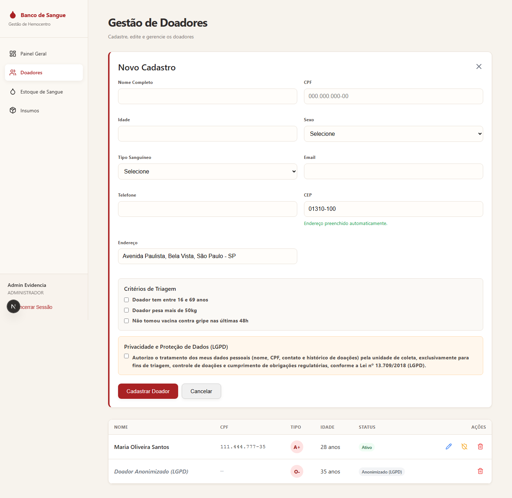

# Evidência 3 — Migração/Integração de API Externa

## Contexto

O sistema não consumia nenhuma API externa (README lista apenas Supabase, que é o próprio banco de dados, e Vercel, que é hospedagem). Seguindo a orientação do enunciado para esse caso ("simular integração com uma API pública simples, ex.: ViaCEP"), integramos o **ViaCEP** (`https://viacep.com.br`) ao formulário de cadastro de doador: o atendente digita o CEP e o sistema preenche automaticamente logradouro, bairro, cidade e UF no campo "Endereço" — reduzindo erro de digitação e tempo de cadastro.

## Antes da adaptação

`app/(protected)/doadores/page.tsx` tinha apenas um campo de texto livre "Endereço", sem nenhuma validação ou apoio de preenchimento — o atendente digitava manualmente rua, bairro e cidade por extenso.

## Testes no Postman (antes de integrar ao sistema)

Coleção completa em [`manutencao-adaptativa/postman/banco-de-sangue-viacep.postman_collection.json`](./postman/banco-de-sangue-viacep.postman_collection.json) (importável no Postman), com exemplos de resposta reais capturados em 21/09/2026:

| Requisição | Status | Observação |
|---|---|---|
| `GET viacep.com.br/ws/01310100/json/` | 200 | CEP válido (Av. Paulista/SP) — resposta JSON completa |
| `GET viacep.com.br/ws/20040020/json/` | 200 | CEP válido (Praça Pio X/RJ) |
| `GET viacep.com.br/ws/00000000/json/` | 200, `{"erro":"true"}` | CEP com 8 dígitos mas inexistente |
| `GET viacep.com.br/ws/123/json/` | **400, corpo HTML (não JSON)** | CEP mal formatado |

O último caso foi decisivo para o design do proxy: descobrimos no Postman que, para CEP mal formatado, o ViaCEP **não retorna JSON, retorna uma página HTML de erro** — se o backend tentasse `response.json()` direto nessa resposta, quebraria com uma exceção de parsing. Por isso o proxy interno valida o formato do CEP (8 dígitos) **antes** de chamar o ViaCEP, nunca repassando esse caso ao provedor externo.

Evidência real via `curl` (equivalente ao que foi testado no Postman):

```
$ curl -s https://viacep.com.br/ws/01310100/json/
{
  "cep": "01310-100",
  "logradouro": "Avenida Paulista",
  "bairro": "Bela Vista",
  "localidade": "São Paulo",
  "uf": "SP",
  ...
}

$ curl -s https://viacep.com.br/ws/00000000/json/
{
  "erro": "true"
}
```

## Adaptação implementada

### 1. Proxy interno (`pages/api/cep/[cep].ts`, novo endpoint)

Em vez de o frontend chamar `viacep.com.br` diretamente, criamos `GET /api/cep/{cep}` como intermediário:

- Reaproveita a autenticação já existente (`requireAuth`) — consistente com todas as outras rotas do sistema.
- Valida o formato do CEP **antes** de repassar ao provedor externo (evita o erro HTML 400 visto no Postman).
- Normaliza o payload do ViaCEP (`localidade` → `cidade`) para o formato que o frontend espera, isolando o sistema de mudanças no contrato do provedor externo — se um dia trocarmos de provedor de CEP (ex.: BrasilAPI), só esse arquivo muda.
- Trata CEP inexistente (`erro: true`) como `404`, e falha de rede/serviço indisponível como `502`.

### 2. Frontend (`app/(protected)/doadores/page.tsx`)

- Novo campo "CEP" antes de "Endereço" no formulário de doador.
- Ao sair do campo (`onBlur`), chama `GET /api/cep/{cep}` via `src/services/api.ts` (axios) e preenche automaticamente "Endereço" com `logradouro, bairro, cidade - UF`.
- Feedback de estado visível ao usuário: "Buscando endereço...", "Endereço preenchido automaticamente." ou "CEP não encontrado, preencha o endereço manualmente." — nunca bloqueia o cadastro, o campo endereço continua editável manualmente.

## Evidência de execução (testes automatizados reais)

```
$ npx jest tests/api-cep.test.ts

PASS tests/api-cep.test.ts
  GET /api/cep/[cep]
    ✓ deve rejeitar CEP com menos de 8 dígitos
    ✓ deve consultar o ViaCEP e normalizar o endereço para CEP válido
    ✓ deve retornar 404 quando o ViaCEP responde erro=true (CEP inexistente)
    ✓ deve retornar 502 se o ViaCEP estiver indisponível

Test Suites: 1 passed, 1 total
Tests:       4 passed, 4 total
```

Suíte completa do projeto após as 3 estratégias:

```
$ npx jest --silent
Test Suites: 5 passed, 5 total
Tests:       33 passed, 33 total
```

## Evidência visual (execução no sistema)

Captura real do formulário rodando localmente (`next dev`) após digitar o CEP `01310-100`: o campo "Endereço" foi preenchido automaticamente com `Avenida Paulista, Bela Vista, São Paulo - SP`, exatamente o dado devolvido pelo ViaCEP capturado no Postman (metodologia em `plano-estrategia.md`):


